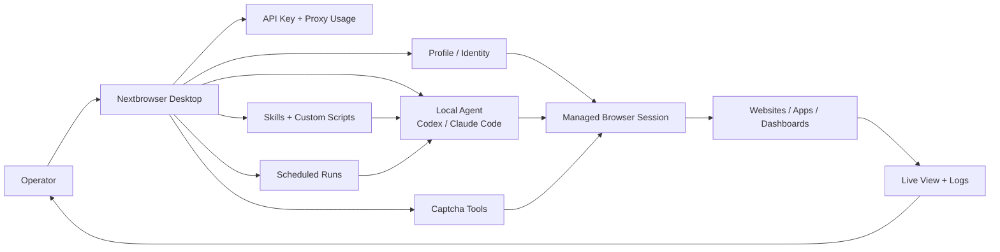

<p align="center">
  
</p>

<h1 align="center">Nextbrowser</h1>

<p align="center">
  <strong>Cross-platform desktop console for running AI agents inside real browser sessions.</strong><br/>
  Manage profiles, proxy usage, isolated sessions, skills, scheduled work, live viewing,<br/>
  captcha workflows, diagnostics, and agent chat from one app.
</p>

<p align="center">
  <a href="https://nextbrowser.com/"></a>
  <a href="https://discord.com/invite/qnKUKMvGB9"></a>
</p>

<p align="center">
  
  <a href="https://opensource.org/licenses/MIT"></a>
  
  
  
</p>

---

## Overview

Nextbrowser is a cross-platform desktop console for running AI agents inside a
real ClawBrowser session. It gives the user a visual control panel for profiles,
proxy usage, browser sessions, skills, scheduled work, live viewing, captcha
workflows, diagnostics, and agent chat.

The app is built with Electron, React, and TypeScript. It runs on macOS and
Windows.

Nextbrowser does not implement browser automation by itself. Browser work goes
through `clawctl`, the ClawBrowser command line controller. The desktop app is
the user interface; `clawctl` is the technical bridge to the browser.

## At A Glance

| Layer | What you control | Why it matters |
| --- | --- | --- |
| Account | API key, proxy usage, runtime health | Confirms the account is ready before agents start work. |
| Identity | Profiles, countries, proxy/fingerprint rotation | Keeps jobs, accounts, regions, and retries separated. |
| Session | Start/stop browser, open tabs, live view | Gives agents a real browser context you can inspect. |
| Agent | Codex, Claude Code, other local CLIs | Streams prompts, tool output, status, queues, and forks. |
| Workflow | Skills, custom scripts, schedules, captcha flows | Makes repeated browser work reusable and observable. |

## Flow Map



<details>
<summary><b>Table of Contents</b></summary>

- [At A Glance](#at-a-glance)
- [Flow Map](#flow-map)
- [What Nextbrowser Is For](#what-nextbrowser-is-for)
- [Core Concepts](#core-concepts)
- [Main Screens](#main-screens)
- [Typical Workflows](#typical-workflows)
- [Technical Command Reference](#technical-command-reference)
- [Configuration](#configuration)
- [Local State](#local-state)
- [Troubleshooting](#troubleshooting)
- [Mental Model](#mental-model)
- [Development](#development)
- [Platform Support](#platform-support)
- [License](#license)

</details>

## What Nextbrowser Is For

Use Nextbrowser when you want to:

| Goal | App surface | Result |
| --- | --- | --- |
| Log in once with a ClawBrowser API key | Login | One authenticated account shared by the desktop app and `clawctl`. |
| See proxy usage before tasks | Sidebar | You know account traffic and proxy state before a run starts. |
| Manage browser profiles | Sidebar / profiles list | Jobs, accounts, customers, countries, and tests stay isolated. |
| Start and stop sessions | Session actions | Agents get a real browser only when the profile is running. |
| Rotate proxy/fingerprint identity | Profile controls | Fresh IP, country, or browser identity before sensitive retries. |
| Run Codex, Claude Code, or another local agent | Agent selector + Chat | Agent output streams into one visible work surface. |
| Run browser work on a VPS | Chat → Use VPS | Pick an SSH host and keep `clawctl` execution on the remote machine. |
| Keep separate agent histories | Chat | Conversations stay organized per agent and workflow. |
| Queue, stop, edit, and fork prompts | Chat controls | Long-running work remains controllable instead of fire-and-forget. |
| Install reusable skills | Skills | Repeat website or captcha workflows without rewriting instructions. |
| Save private custom scripts | Custom Scripts | Internal operating procedures become reusable prompts. |
| Schedule recurring work | Scheduled Runs | Monitoring, scraping, reports, and checks run on a routine. |
| Watch the browser live | Live View | You can inspect the page while the agent works. |
| Solve or delegate captchas | Captcha workflows | The agent can handle page challenges through `clawctl` tools. |

## Core Concepts

### API Key

The API key connects the app to your ClawBrowser account. It is saved in the
same place `clawctl` expects, so the desktop app and CLI share one authenticated
identity.

The app can:

- accept a key on the login screen;
- auto-detect a key already configured in `clawctl`;
- validate the key;
- use it to load proxy usage, profiles, and skills.

CLI equivalent:

```sh
clawctl config set --api-key "$CLAWBROWSER_API_KEY"
clawctl identity --json
```

### Profile

A profile is an isolated browser identity. It can have its own proxy settings,
country hint, browser state, and session status.

Use separate profiles for separate jobs, accounts, customers, countries, or test
runs.

### Session

A session is the running browser for a profile. A profile can exist without
being currently open. Starting a session launches the managed browser and makes
it controllable by the app and by agents.

### Proxy And Fingerprint

Nextbrowser shows proxy usage and lets you rotate the browser identity. Rotation
is useful when you need:

- a fresh IP;
- another country;
- a new browser identity before a task;
- a retry after a site block or captcha throttling.

Country rotation should be verified so the proxy/fingerprint setup remains
coherent.

CLI equivalent:

```sh
clawctl rotate --profile work --country FR --verify --json
clawctl verify --profile work --json
```

### Agent

An agent is an installed local CLI that can receive a prompt and perform work.
Nextbrowser launches the agent, streams its output into chat, and gives it the
browser context.

Primary agents:

- Claude Code;
- Codex.

Additional known integrations include Hermes Agent, Kilo Code, OpenClaw, Cline,
Gemini CLI, Qwen Code, OpenCode, Cursor Agent, Goose, Aider, Amp, LLM, aichat,
Shell GPT, Open Interpreter, Amazon Q, Continue, and others.

### Skill

A skill is a reusable instruction file for an agent. It can describe how to use
a website, how to solve a captcha, or how to run a private workflow.

Instead of explaining the same website repeatedly, apply a skill and run it from
the app.

## Main Screens

| Screen | Primary job | Key controls |
| --- | --- | --- |
| Login | Connect account | API key input, key detection, validation status. |
| Sidebar | Operate the active browser setup | Proxy usage, profile list, agent selector, session actions. |
| Chat | Run agents | Prompts, queue, stop, edit, fork, files, statuses, output. |
| Skills | Reuse workflows | Domain skills, captcha skills, private scripts, preflight. |
| Scheduled Runs | Automate routines | Prompt, agent, time, weekdays, enabled state, linked chat. |
| Live View | Watch the browser | Running profile, visible page, live frames, debugging context. |
| Guide | Onboard and test setup | Guided prompts, first-run checks, app section explanations. |

### Login

The login screen accepts a ClawBrowser API key. After a successful login,
Nextbrowser stores the key through `clawctl` and moves into the main app.

If a valid key already exists, the app can skip manual login.

### Sidebar

The sidebar is the operational control area. It shows:

- proxy usage and limits;
- current proxy state;
- agent selector;
- profile search;
- profile list;
- running/stopped status;
- selected profile;
- session actions;
- app/runtime status where available.

From the sidebar you can start, stop, rotate, and select profiles without
leaving the current chat.

### Chat

The Chat tab is where you work with agents.

Supported chat features:

- per-agent conversation history;
- multiple named conversations;
- create, rename, and delete chats;
- fork a conversation from an earlier message;
- queue prompts while a message is running;
- stop the current run;
- cancel or edit queued messages;
- attach local files;
- copy message output;
- clear chat;
- see message status;
- see tool/activity updates while the agent is running.

Message statuses include:

- queued;
- streaming;
- done;
- failed;
- cancelled;
- timed out.

The agent receives enough context to use the active browser session through
`clawctl`.

For remote work, choose **Use VPS** in an empty chat. Nextbrowser reads host
aliases from the current user's `~/.ssh/config` (the same location is used from
the Windows user profile), follows safe config includes under that `.ssh`
directory, and lets you add another SSH config or enter a host manually. The generated conversation is
remote-only: the agent connects over SSH and does not fall back to the local
`clawctl` or browser runtime.

### Skills

The Skills tab contains reusable workflows. A skill may target:

- a domain;
- a captcha type;
- a private script.

Typical flow:

1. Open Skills.
2. Pick a skill.
3. Apply it.
4. Run it in chat.
5. Nextbrowser prepares the browser session.
6. The agent follows the installed skill instructions.

Before a skill or script runs, Nextbrowser performs deterministic session
preflight:

- check whether the selected profile is running;
- start it if needed;
- check open tabs;
- activate a matching tab if it already exists;
- otherwise open the target page;
- wait for the page to be ready;
- send the skill prompt to the agent.

This prevents many common "agent started from the wrong page" failures.

### Custom Scripts

Custom scripts are private reusable instructions. They are useful for workflows
that are too specific for a public skill but too repetitive to type every time.

Examples:

- open an internal dashboard and summarize a table;
- check a site every morning;
- export information from a known page;
- follow a private operating procedure for a website.

### Scheduled Runs

Scheduled runs let Nextbrowser trigger prompts automatically.

A scheduled run includes:

- title;
- prompt;
- selected agent;
- hour;
- minute;
- weekdays;
- enabled/disabled state;
- optional linked conversation.

Use scheduled runs for monitoring, recurring reports, repeated scraping, and
routine checks.

### Live View

The Live tab lets you watch the running browser session from inside the desktop
app.

Requirements:

- a profile must be running;
- the browser must have at least one page tab;
- the page should visually update when new frames are expected.

If the Live tab is empty, check the session and open a page:

```sh
clawctl status --profile work --json
clawctl open --profile work https://example.com --json
clawctl tabs list --profile work --json
```

### Guide And Onboarding

The Guide and onboarding screens explain the app sections and provide guided
prompts for common flows. They are intended for first-time users and for quickly
testing whether the local setup is ready.

## Typical Workflows

| Workflow | Start from | Main surfaces | Command family |
| --- | --- | --- | --- |
| First-time setup | Login | Sidebar, Chat, Live View | `config`, `install`, `identity`, `start`, `verify` |
| Run an agent on a website | Selected profile | Sidebar, Chat, Live View | `start`, `verify`, `state` |
| Use a skill | Skills | Skills, Chat, profile preflight | `skill list`, `skill check` |
| Rotate identity | Profile controls | Sidebar, Live View | `start`, `rotate`, `open` |
| Run on a VPS | Chat → Use VPS | SSH host picker, Chat | local `ssh`; remote `clawctl` |
| Work with captchas | Active page | Chat, Live View, captcha tools | `captcha detect`, `captcha auto`, provider delegation |
| Debug a broken task | Any failed run | Sidebar, Chat, Live View, diagnostics | `identity`, `proxy-traffic`, `status`, `tabs`, `state`, `screenshot`, `verify` |

### First-Time Setup

1. Install or build `clawctl`.
2. Configure the ClawBrowser API key.
3. Install browser runtime and agent integration.
4. Start Nextbrowser.
5. Select or create a profile.
6. Start a session.
7. Choose an agent.
8. Send a prompt.

CLI shape:

```sh
clawctl config set --api-key "$CLAWBROWSER_API_KEY"
clawctl install --agent codex --no-api-key-prompt --json
clawctl identity --json
clawctl start --profile work --url https://example.com --json
clawctl verify --profile work --json
```

### Run An Agent On A Website

1. Select a profile.
2. Start the profile.
3. Open the target site.
4. Verify identity if the task depends on location or fingerprint quality.
5. Select Codex or Claude Code.
6. Send a prompt.
7. Watch progress in Chat and Live.
8. Stop, queue, edit, or fork as needed.

Useful commands:

```sh
clawctl start --profile work --url https://target.example --json
clawctl verify --profile work --json
clawctl state --profile work --json
```

### Run Browser Work On A VPS

1. Open an empty chat and choose **Use VPS**.
2. Select an alias discovered from `~/.ssh/config`, add another config file, or
   enter the SSH host manually.
3. Optionally describe the browser task and start the VPS conversation.
4. The agent connects with the selected SSH settings and checks `clawctl` on
   the VPS before doing browser work.

Nextbrowser does not open configured identity files or ask for an SSH password.
It imports only `HostName`, `User`, `Port`, and the `IdentityFile` path, then
builds a direct SSH command with the source config disabled. That prevents
`Match exec`, `ProxyCommand`, `KnownHostsCommand`, `LocalCommand`, and included
config directives from executing locally. If Clawbrowser or `clawctl` is
missing on the VPS, the agent stops and asks you to install it there first. It
must not install or run the browser on localhost as a fallback.

### Use A Skill

1. Open Skills.
2. Choose a skill.
3. Apply it.
4. Run it.
5. Let the agent follow the skill.

Useful commands:

```sh
clawctl skill list --json
clawctl skill check --domain target.example --json
```

### Rotate To A Fresh Country Identity

```sh
clawctl start --profile work --json
clawctl rotate --profile work --country DE --verify --json
clawctl open --profile work https://example.com --json
```

Use this before tasks where country, IP quality, or fingerprint consistency
matter.

### Work With Captchas

Nextbrowser does not hide captcha handling behind magic. Captcha work is done
through `clawctl captcha`, and the agent can use those commands when needed.

Useful commands:

```sh
clawctl captcha detect --profile work --json
clawctl captcha auto --profile work --json
clawctl captcha click-and-solve --profile work --challenge-mode audio --json
clawctl captcha audio-solve --profile work --json
clawctl captcha call-user --profile work --provider 2captcha --json
```

Practical rules:

- use `captcha detect` first when debugging;
- use `captcha auto` when you want the tool to choose a strategy;
- visible reCAPTCHA can often start with click/audio;
- enterprise reCAPTCHA usually works better with in-browser audio because the IP
  stays the same;
- invisible/v3/hCaptcha/Turnstile often require provider delegation;
- if audio is throttled, rotate to a fresh verified identity and retry.

Retry shape:

```sh
clawctl rotate --profile work --country US --verify --json
clawctl captcha auto --profile work --challenge-mode audio --timeout 130s --json
```

### Debug A Broken Browser Task

Run checks from account level down to page level:

```sh
clawctl identity --json
clawctl proxy-traffic --json
clawctl profiles ls --json
clawctl status --profile work --json
clawctl tabs list --profile work --json
clawctl state --profile work --json
clawctl screenshot --profile work --full-page --json
clawctl verify --profile work --json
```

This usually tells you whether the issue is API key, proxy usage, missing
profile, stopped session, wrong tab, broken page state, or identity mismatch.

## Technical Command Reference

These are the `clawctl` commands most relevant while using Nextbrowser.

| Group | Commands | Use when |
| --- | --- | --- |
| Account | `config`, `identity`, `proxy-traffic` | Login, auth checks, traffic checks. |
| Profiles | `profiles create`, `profiles ls`, `profiles inspect`, `profiles rm` | Managing isolated identities. |
| Sessions | `start`, `status`, `stop` | Opening, checking, and closing browser sessions. |
| Rotation | `rotate`, `verify` | Refreshing or validating proxy/fingerprint identity. |
| Browser control | `state`, `open`, `click`, `input`, `press`, `select`, `scroll`, `wait`, `screenshot`, `dismiss` | Driving and inspecting pages. |
| Tabs | `tabs list`, `tabs activate`, `tabs close`, `open --new-tab` | Recovering from wrong-tab or multi-tab states. |
| Skills | `skill list`, `skill check`, `skill add` | Reusing website and captcha instructions. |
| Captcha | `captcha detect`, `captcha auto`, `captcha click-and-solve`, `captcha audio-solve`, `captcha call-user`, `captcha stats` | Handling page challenges. |
| Diagnostics | `update`, `doctor`, `version` | Runtime updates and environment checks. |

### Account

```sh
clawctl config set --api-key "$CLAWBROWSER_API_KEY"
clawctl identity --json
clawctl proxy-traffic --json
```

### Profiles

```sh
clawctl profiles create NAME --country US --json
clawctl profiles ls --json
clawctl profiles inspect NAME --json
clawctl profiles rm NAME --json
```

### Sessions

```sh
clawctl start --profile NAME --json
clawctl start --profile NAME --url https://example.com --json
clawctl status --profile NAME --json
clawctl stop --profile NAME --json
```

### Rotation And Verification

```sh
clawctl rotate --profile NAME --json
clawctl rotate --profile NAME --country FR --verify --json
clawctl verify --profile NAME --json
```

### Browser Control

```sh
clawctl state --profile NAME --json
clawctl open --profile NAME https://example.com --json
clawctl click --profile NAME ELEMENT_ID --json
clawctl input --profile NAME ELEMENT_ID "text" --json
clawctl press --profile NAME Enter --json
clawctl select --profile NAME ELEMENT_ID VALUE --json
clawctl scroll --profile NAME 500 --json
clawctl wait --profile NAME --load --timeout 10s --json
clawctl screenshot --profile NAME --full-page --json
clawctl dismiss --profile NAME --json
```

### Tabs

```sh
clawctl tabs list --profile NAME --json
clawctl tabs activate --profile NAME TAB_ID --json
clawctl tabs close --profile NAME TAB_ID --json
clawctl open --profile NAME https://example.com --new-tab --json
```

### Skills

```sh
clawctl skill list --json
clawctl skill check --domain example.com --json
clawctl skill check --captcha hcaptcha --json
clawctl skill add --domain example.com --file SKILL.md --json
```

### Captcha

```sh
clawctl captcha detect --profile NAME --json
clawctl captcha auto --profile NAME --json
clawctl captcha click-and-solve --profile NAME --challenge-mode audio --json
clawctl captcha audio-solve --profile NAME --json
clawctl captcha call-user --profile NAME --provider capmonster --json
clawctl captcha stats --json
```

### Updates And Diagnostics

```sh
clawctl update
clawctl doctor --json
clawctl version
```

## Configuration

### Binary Overrides

Use these when the app cannot find local binaries automatically:

```sh
export CLAWCTL_BIN=/absolute/path/to/clawctl
export CODEX_BIN=/absolute/path/to/codex
export CLAUDE_BIN=/absolute/path/to/claude
```

Other agents follow the same idea: uppercase the binary name, replace dashes
with underscores, and add `_BIN`.

### SSH Configs

The VPS picker automatically checks the current user's SSH config:

- macOS: `~/.ssh/config`;
- Windows: `%USERPROFILE%\.ssh\config`.

Config-like OpenSSH `Include` entries under the current user's `.ssh` directory
are followed; conditional, extensionless, network, linked, and outside-directory
includes are ignored with a warning. Extra config-file paths added in the
picker must be named `config` or end in `.conf`/`.config` and are saved in
Nextbrowser app data so they remain available after a restart. SSH passwords
and identity-file contents are never stored by the app.

### Analytics

GA4 is enabled by default for the Nextbrowser stream. Analytics events use a
generated anonymous app instance ID and do not send API keys, prompt text, target
URLs, or page domains.

Override the stream only for a special build by setting
`VITE_GA4_MEASUREMENT_ID` in that build environment.

## Local State

Important local state:

| State | Owner |
| --- | --- |
| ClawBrowser API key | Stored through `clawctl`. |
| Profiles and browser sessions | Managed by ClawBrowser through `clawctl`. |
| Conversations | Nextbrowser app data storage. |
| Scheduled runs | Nextbrowser app data storage. |
| Custom scripts | Nextbrowser app data storage and skill sync. |
| Agent skills | Agent-specific skill/plugin directories. |
| App update state | Nextbrowser app data storage. |
| Added SSH config paths | Nextbrowser app data storage; config contents remain in their original files. |

Do not paste API keys into prompts, custom scripts, chat messages, or agent
configuration files. Let `clawctl` store the key.

## Troubleshooting

### Nextbrowser Cannot Find `clawctl`

Set the path explicitly and restart the app:

```sh
export CLAWCTL_BIN=/absolute/path/to/clawctl
```

Then check:

```sh
clawctl version
```

### Agent Is Not Found

Set the agent binary path:

```sh
export CODEX_BIN=/absolute/path/to/codex
export CLAUDE_BIN=/absolute/path/to/claude
```

Then restart the app and re-check the agent from the sidebar or chat header.

### VPS Hosts Are Not Listed

Check that the config file is readable and contains concrete `Host` aliases.
Wildcard and negated host patterns are intentionally omitted. You can also use
**Add SSH config** or switch to **Manual connection** in the VPS picker.
OpenSSH itself is required when the agent later connects, but discovery reads
the config directly.

### API Key Does Not Work

Check identity:

```sh
clawctl identity --json
```

If needed, save the key again:

```sh
clawctl config set --api-key "$CLAWBROWSER_API_KEY"
```

### Profile Is Not Running

```sh
clawctl status --profile work --json
clawctl start --profile work --json
```

### Website Is Open In The Wrong Tab

```sh
clawctl tabs list --profile work --json
clawctl tabs activate --profile work TAB_ID --json
```

### Browser Identity Looks Wrong

```sh
clawctl verify --profile work --json
clawctl rotate --profile work --country US --verify --json
```

### Live View Is Empty

```sh
clawctl status --profile work --json
clawctl open --profile work https://example.com --json
clawctl tabs list --profile work --json
```

Also make sure the page is visually changing. Static pages may keep the last
frame until something updates.

### Captcha Keeps Failing

Use a fresh verified identity and choose the strategy for the captcha type:

```sh
clawctl rotate --profile work --country US --verify --json
clawctl captcha detect --profile work --json
clawctl captcha auto --profile work --challenge-mode audio --timeout 130s --json
```

If the captcha is invisible, v3, hCaptcha, or Turnstile, provider delegation is
usually more appropriate than a visible checkbox/audio flow.

### Proxy Limit Is Reached

Check usage:

```sh
clawctl proxy-traffic --json
```

Top up from the dashboard before running long scraping or agent tasks.

## Mental Model

When using Nextbrowser, think in this order:

1. API key authorizes the account.
2. Profile defines the browser identity.
3. Session is the running browser.
4. Proxy and fingerprint should verify.
5. Agent receives the task.
6. `clawctl` performs browser actions.
7. Skills provide reusable instructions.
8. Live view shows what is happening.
9. Rotation refreshes identity.
10. Captcha tools are used only when the page requires them.

If a task fails, debug in the same order: account, proxy usage, profile, session,
tab, page state, verification, agent login, skill instructions, and captcha
strategy.

## Development

```bash
# Install dependencies
npm ci

# Run tests
npm test

# Start the local dev app
npm run dev

# Build / package
npm run build
npm run pack
npm run dist:mac
npm run dist:win
```

## Platform Support

| Platform | Mode | Notes |
| --- | --- | --- |
| macOS | Native desktop app | Apple Silicon release builds are available through the product setup path. |
| Windows | Native desktop app | 64-bit Windows release builds are available through the product setup path. |
| Source | Local development | Clone the app repository, install dependencies, run tests, then start the dev app. |

## License

Distributed under the **MIT** license. Full text: [opensource.org/licenses/MIT](https://opensource.org/licenses/MIT).

---

<p align="center">
  <sub>(c) 2026 Nextbrowser. Available on macOS and Windows.</sub>
</p>
