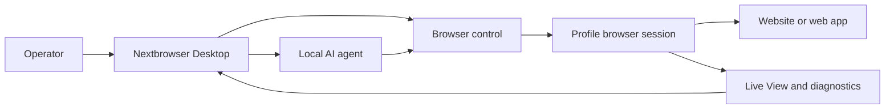

  

<h1 align="center">Nextbrowser</h1>

  <strong>An Electron, React, and TypeScript desktop console for running local AI agents in managed browser sessions on macOS and Windows.</strong>

  <a href="https://nextbrowser.com/">Website</a> ·
  <a href="https://docs.nextbrowser.com/">Product docs</a> ·
  <a href="https://nextbrowser.com/use-cases">Use cases</a> ·
  <a href="https://github.com/nextbrowser-oss/nextbrowser-app/releases/latest">Download</a> ·
  <a href="https://github.com/nextbrowser-oss/nextbrowser-app/discussions">Discussions</a>

  
  
  
  

  English ·
  <a href="docs/i18n/es/README.md">Español</a> ·
  <a href="docs/i18n/pt-BR/README.md">Português (Brasil)</a> ·
  <a href="docs/i18n/zh-CN/README.md">简体中文</a> ·
  <a href="docs/i18n/ja/README.md">日本語</a> ·
  <a href="docs/i18n/ko/README.md">한국어</a> ·
  <a href="docs/i18n/de/README.md">Deutsch</a> ·
  <a href="docs/i18n/fr/README.md">Français</a> ·
  <a href="docs/i18n/ru/README.md">Русский</a> ·
  <a href="docs/i18n/uk/README.md">Українська</a> ·
  <a href="docs/i18n/ar/README.md">العربية</a> ·
  <a href="docs/i18n/hi/README.md">हिन्दी</a> ·
  <a href="docs/i18n/tr/README.md">Türkçe</a> ·
  <a href="docs/i18n/id/README.md">Bahasa Indonesia</a> ·
  <a href="docs/i18n/vi/README.md">Tiếng Việt</a> ·
  <a href="docs/i18n/th/README.md">ไทย</a> ·
  <a href="docs/i18n/it/README.md">Italiano</a> ·
  <a href="docs/i18n/pl/README.md">Polski</a> ·
  <a href="docs/i18n/nl/README.md">Nederlands</a> ·
  <a href="docs/i18n/fa/README.md">فارسی</a>

  

## Why Nextbrowser

Browser work by an AI agent spans more than a prompt: an operator must choose a browser identity, control the session, keep the agent process observable, and recover when a page or run fails. Nextbrowser brings those controls into one desktop surface.

- Keep profiles, sessions, proxy/fingerprint rotation, and agent work in one operational view.
- Inspect streamed agent output and browser activity instead of treating runs as fire-and-forget.
- Reuse workflows through skills, custom scripts, preflight checks, and schedules.
- Diagnose browser state and invoke captcha tools when a page presents a challenge; successful solving is never guaranteed.

## Key features

| Area | What is available |
| --- | --- |
| Profiles and sessions | Manage profiles, session lifecycle, and proxy/fingerprint rotation. |
| Agent workspace | Run local agents with chat history, queues, stop/edit controls, and conversation forks. |
| Reusable workflows | Apply skills and custom scripts with browser-session preflight. |
| Scheduled work | Configure recurring agent runs and review them from the desktop console. |
| Visibility | Use Live View, run status, and diagnostics to inspect browser work. |
| Captcha tooling | Detect challenges and invoke supported handling flows without a bypass guarantee. |

See the [product guide](docs/product-guide.md) for concepts, screens, workflows, and operating guidance.

## Quick Start

1. Download an available macOS or Windows build from the [latest Nextbrowser release](https://github.com/nextbrowser-oss/nextbrowser-app/releases/latest).
2. Follow the [product documentation](https://docs.nextbrowser.com/) to configure your browser environment.
3. Open Nextbrowser, select a profile, start its session, choose an installed local agent, and submit a task.
4. Keep Chat and Live View open while the task runs; stop, edit, queue, or fork work when needed.

For browser controls and diagnostics, use the [browser control reference](docs/cli-reference.md). For application and browser configuration, see [configuration](docs/configuration.md).

## Demos and use cases

Explore published scenarios on the [Nextbrowser use-cases page](https://nextbrowser.com/use-cases). The preview above shows the NextBrowser interface in action.

Common workflows include:

- start a profile session, give a local agent a browser task, and observe progress;
- apply a skill or private custom script after session preflight;
- schedule a recurring task without assigning a release-date promise to the workflow;
- inspect session, tab, page, and identity state when a run fails;
- detect a captcha and choose an available handling path, with human intervention when required.

## How it works

Nextbrowser is the desktop control surface. Profiles define browser identities, sessions provide the running browser context, and browser activity remains visible through Live View and diagnostics. Read the [product guide](docs/product-guide.md) for the full mental model.

## Documentation

- [Product guide](docs/product-guide.md) — concepts, screens, workflows, and safety.
- [Browser control reference](docs/cli-reference.md) — browser operations and diagnostics used with Nextbrowser.
- [Configuration and development](docs/configuration.md) — application settings, local state, analytics notes, and development scripts.
- [Troubleshooting](docs/troubleshooting.md) — account-to-page diagnostics and common recovery paths.
- [Language index](docs/i18n/README.md) — all 20 README editions.

## Roadmap

Roadmap work is tracked through [GitHub Issues](https://github.com/nextbrowser-oss/nextbrowser-app/issues) and project boards. An issue or project card is a proposal, not a release commitment; no dates are implied.

## Contributing

Read [CONTRIBUTING.md](CONTRIBUTING.md) before opening a change. Use the structured issue forms for reproducible bugs, focused feature proposals, demo requests, and documentation fixes. README changes must keep all 19 translations and the i18n manifest synchronized.

## Community and support

- Join the [Nextbrowser Discord](https://discord.gg/jfYjwJQdQ) for community chat, setup help, and product updates.
- Ask general questions and share ideas in [GitHub Discussions](https://github.com/nextbrowser-oss/nextbrowser-app/discussions).
- Use [GitHub Issues](https://github.com/nextbrowser-oss/nextbrowser-app/issues) for actionable, scoped work.
- Follow [SECURITY.md](SECURITY.md) for private vulnerability reporting; do not publish security details in an issue.
- Start with [troubleshooting](docs/troubleshooting.md) for runtime and browser-session problems.

## License

Nextbrowser is open-source software available under the [MIT License](LICENSE).

Copyright © 2026 Nextbrowser contributors.
