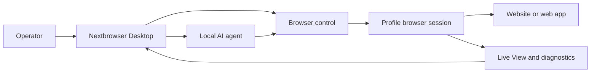

<!-- i18n-source-sha256: af4bcd2f6a6e0d0d097d0d490899d87da19f18d99ab163ce82c094c760efea99 -->

  

<h1 align="center">Nextbrowser</h1>

  <strong>وحدة تحكم مكتبية مبنية باستخدام Electron وReact وTypeScript لتشغيل وكلاء الذكاء الاصطناعي المحليين داخل جلسات متصفح مُدارة على macOS وWindows.</strong>

  <a href="https://nextbrowser.com/">الموقع</a> ·
  <a href="https://docs.nextbrowser.com/">وثائق المنتج</a> ·
  <a href="https://nextbrowser.com/use-cases">حالات الاستخدام</a> ·
  <a href="https://github.com/nextbrowser-oss/nextbrowser-app/releases/latest">تنزيل</a> ·
  <a href="https://github.com/nextbrowser-oss/nextbrowser-app/discussions">المناقشات</a>

  
  
  

  <a href="../../../README.md">English</a> ·
  <a href="../es/README.md">Español</a> ·
  <a href="../pt-BR/README.md">Português (Brasil)</a> ·
  <a href="../zh-CN/README.md">简体中文</a> ·
  <a href="../ja/README.md">日本語</a> ·
  <a href="../ko/README.md">한국어</a> ·
  <a href="../de/README.md">Deutsch</a> ·
  <a href="../fr/README.md">Français</a> ·
  <a href="../ru/README.md">Русский</a> ·
  <a href="../uk/README.md">Українська</a> ·
  <strong>العربية</strong> ·
  <a href="../hi/README.md">हिन्दी</a> ·
  <a href="../tr/README.md">Türkçe</a> ·
  <a href="../id/README.md">Bahasa Indonesia</a> ·
  <a href="../vi/README.md">Tiếng Việt</a> ·
  <a href="../th/README.md">ไทย</a> ·
  <a href="../it/README.md">Italiano</a> ·
  <a href="../pl/README.md">Polski</a> ·
  <a href="../nl/README.md">Nederlands</a> ·
  <a href="../fa/README.md">فارسی</a>

  

## لماذا Nextbrowser

يتجاوز عمل وكيل الذكاء الاصطناعي في المتصفح مجرد prompt واحد؛ إذ يجب على المشغّل اختيار هوية المتصفح والتحكم في الجلسة ومراقبة عملية الوكيل والتعافي عند فشل الصفحة أو التشغيل. يجمع Nextbrowser هذه الضوابط في واجهة مكتبية واحدة.

- احتفظ بالملفات الشخصية والجلسات ودوران proxy/fingerprint وعمل الوكلاء في عرض تشغيلي واحد.
- افحص مخرجات الوكيل المتدفقة ونشاط المتصفح بدلًا من التعامل مع عمليات التشغيل كمهام تُطلق ثم تُترك دون متابعة.
- أعد استخدام سير العمل عبر skills والبرامج النصية المخصصة وفحوصات preflight والجداول الزمنية.
- شخّص حالة المتصفح واستدع أدوات captcha عندما تعرض الصفحة تحديًا؛ لا يُضمن نجاح الحل مطلقًا.

## الميزات الرئيسية

| المجال | المتاح |
| --- | --- |
| الملفات الشخصية والجلسات | إدارة الملفات الشخصية ودورة حياة الجلسة ودوران proxy/fingerprint. |
| مساحة عمل الوكيل | تشغيل وكلاء محليين مع سجل Chat وقوائم انتظار وعناصر تحكم للإيقاف/التحرير وتفرعات المحادثة. |
| سير عمل قابل لإعادة الاستخدام | تطبيق skills والبرامج النصية المخصصة مع فحص preflight لجلسة المتصفح. |
| العمل المجدول | إعداد عمليات تشغيل متكررة للوكلاء ومراجعتها من وحدة التحكم المكتبية. |
| الرؤية | استخدم Live View وحالة التشغيل والتشخيصات لفحص عمل المتصفح. |
| أدوات captcha | اكتشف التحديات وشغّل مسارات المعالجة المدعومة من دون ضمان التجاوز. |

راجع [دليل المنتج](../../product-guide.md) للتعرف على المفاهيم والشاشات وسير العمل وإرشادات التشغيل.

## البدء السريع

1. نزّل إصدار macOS أو Windows متاحًا من [أحدث إصدار لـ Nextbrowser](https://github.com/nextbrowser-oss/nextbrowser-app/releases/latest).
2. اتبع [وثائق المنتج](https://docs.nextbrowser.com/) لإعداد بيئة المتصفح وAPI key.
3. افتح Nextbrowser، وحدد ملفًا شخصيًا، وابدأ جلسته، واختر وكيلًا محليًا مثبتًا، ثم أرسل مهمة.
4. أبقِ Chat وLive View مفتوحين أثناء تشغيل المهمة؛ وأوقف العمل أو حرره أو ضعه في قائمة الانتظار أو أنشئ تفرعًا منه عند الحاجة.

راجع [مرجع التحكم في المتصفح](../../cli-reference.md) لعناصر التحكم والتشخيصات، وراجع [الإعدادات](../../configuration.md) لإعداد التطبيق والمتصفح.

## العروض التوضيحية وحالات الاستخدام

استكشف السيناريوهات المنشورة في [صفحة حالات استخدام Nextbrowser](https://nextbrowser.com/use-cases). تعرض المعاينة أعلاه واجهة NextBrowser أثناء العمل.

تشمل سير العمل الشائعة:

- بدء جلسة ملف شخصي، وإعطاء وكيل محلي مهمة في المتصفح، ومراقبة التقدم؛
- تطبيق skill أو برنامج نصي مخصص خاص بعد فحص preflight للجلسة؛
- جدولة مهمة متكررة دون إسناد وعد بموعد إصدار إلى سير العمل؛
- فحص حالة الجلسة وعلامة التبويب والصفحة والهوية عند فشل تشغيل؛
- اكتشاف captcha واختيار مسار معالجة متاح، مع تدخل بشري عند الحاجة.

## آلية العمل

Nextbrowser هو سطح التحكم المكتبي. تحدد الملفات الشخصية هويات المتصفح، وتوفر الجلسات السياق النشط، ويظل نشاط المتصفح مرئيًا عبر Live View والتشخيصات. اقرأ [دليل المنتج](../../product-guide.md) لفهم النموذج الكامل.

## الوثائق

- [دليل المنتج](../../product-guide.md) — المفاهيم والشاشات وسير العمل والسلامة.
- [مرجع التحكم في المتصفح](../../cli-reference.md) — عمليات المتصفح والتشخيصات المستخدمة مع Nextbrowser.
- [الإعداد والتطوير](../../../docs/configuration.md) — إعدادات التطبيق والحالة المحلية وملاحظات التحليلات ونصوص التطوير.
- [استكشاف الأخطاء وإصلاحها](../../troubleshooting.md) — التشخيصات من الحساب إلى الصفحة ومسارات الاستعادة الشائعة.
- [فهرس اللغات](../README.md) — إصدارات README العشرون كلها.

## خريطة الطريق

تُتابع أعمال خارطة الطريق عبر [GitHub Issues](https://github.com/nextbrowser-oss/nextbrowser-app/issues) ولوحات المشاريع. تمثل المشكلة أو بطاقة المشروع اقتراحًا وليست التزامًا بإصدار، ولا تشير إلى موعد محدد.

## المساهمة

اقرأ [CONTRIBUTING.md](../../../CONTRIBUTING.md) قبل فتح تغيير. استخدم نماذج issue المنظمة للأخطاء القابلة لإعادة الإنتاج، واقتراحات الميزات المركزة، وطلبات العروض التوضيحية، وإصلاحات الوثائق. يجب أن تحافظ تغييرات README على مزامنة الترجمات التسعة عشر كلها وi18n manifest.

## المجتمع والدعم

- اطرح الأسئلة العامة وشارك الأفكار في [GitHub Discussions](https://github.com/nextbrowser-oss/nextbrowser-app/discussions).
- استخدم [GitHub Issues](https://github.com/nextbrowser-oss/nextbrowser-app/issues) للعمل القابل للتنفيذ والمحدد النطاق.
- اتبع [SECURITY.md](../../../SECURITY.md) للإبلاغ الخاص عن الثغرات؛ لا تنشر تفاصيل الأمان في issue.
- ابدأ بـ [استكشاف الأخطاء وإصلاحها](../../troubleshooting.md) لمشكلات runtime وجلسات المتصفح.

## الترخيص

يُوزَّع بموجب ترخيص **MIT**. النص الكامل: [opensource.org/licenses/MIT](https://opensource.org/licenses/MIT).
