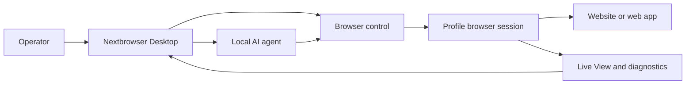

<!-- i18n-source-sha256: 7d99b995b47d93fc8a39fab53df59eab6cc4102b4b900d0d581d9ff8175bb1b5 -->

  

<h1 align="center">Nextbrowser</h1>

  <strong>Eine mit Electron, React und TypeScript entwickelte Desktop-Konsole, mit der lokale KI-Agenten unter macOS und Windows in verwalteten Browsersitzungen ausgeführt werden.</strong>

  <a href="https://nextbrowser.com/">Website</a> ·
  <a href="https://docs.nextbrowser.com/">Produktdokumentation</a> ·
  <a href="https://nextbrowser.com/use-cases">Anwendungsfälle</a> ·
  <a href="https://github.com/nextbrowser-oss/nextbrowser-app/releases/latest">Download</a> ·
  <a href="https://github.com/nextbrowser-oss/nextbrowser-app/discussions">Discussions</a>

  
  
  

  <a href="../../../README.md">English</a> ·
  <a href="../es/README.md">Español</a> ·
  <a href="../pt-BR/README.md">Português (Brasil)</a> ·
  <a href="../zh-CN/README.md">简体中文</a> ·
  <a href="../ja/README.md">日本語</a> ·
  <a href="../ko/README.md">한국어</a> ·
  <strong>Deutsch</strong> ·
  <a href="../fr/README.md">Français</a> ·
  <a href="../ru/README.md">Русский</a> ·
  <a href="../uk/README.md">Українська</a> ·
  <a href="../ar/README.md">العربية</a> ·
  <a href="../hi/README.md">हिन्दी</a> ·
  <a href="../tr/README.md">Türkçe</a> ·
  <a href="../id/README.md">Bahasa Indonesia</a> ·
  <a href="../vi/README.md">Tiếng Việt</a> ·
  <a href="../th/README.md">ไทย</a> ·
  <a href="../it/README.md">Italiano</a> ·
  <a href="../pl/README.md">Polski</a> ·
  <a href="../nl/README.md">Nederlands</a> ·
  <a href="../fa/README.md">فارسی</a>

  

## Warum Nextbrowser

Browserarbeit durch einen KI-Agenten umfasst mehr als einen Prompt: Eine Bedienperson muss eine Browseridentität auswählen, die Sitzung steuern, den Agentenprozess beobachten und Fehler einer Seite oder Ausführung beheben können. Nextbrowser bündelt diese Steuerelemente in einer Desktop-Oberfläche.

- Behalte Profile, Sitzungen, Proxy-/Fingerprint-Rotation und Agentenarbeit in einer gemeinsamen Betriebsansicht.
- Prüfe gestreamte Agentenausgaben und Browseraktivitäten, statt Ausführungen nach dem Start unbeaufsichtigt zu lassen.
- Verwende Workflows über Skills, Custom Scripts, Preflight-Prüfungen und Zeitpläne erneut.
- Diagnostiziere den Browserstatus und rufe Captcha-Werkzeuge auf, wenn eine Seite eine Herausforderung präsentiert; eine erfolgreiche Lösung ist niemals garantiert.

## Hauptfunktionen

| Bereich | Verfügbare Funktionen |
| --- | --- |
| Profile und Sitzungen | Verwalte Profile, den Sitzungslebenszyklus und die Proxy-/Fingerprint-Rotation. |
| Agenten-Arbeitsbereich | Führe lokale Agenten mit Chatverlauf, Warteschlangen, Stopp-/Bearbeitungsfunktionen und Conversation Forks aus. |
| Wiederverwendbare Workflows | Wende Skills und Custom Scripts mit einem Preflight der Browsersitzung an. |
| Geplante Arbeit | Konfiguriere wiederkehrende Agentenausführungen und überprüfe sie in der Desktop-Konsole. |
| Sichtbarkeit | Nutze Live View, Ausführungsstatus und Diagnosen, um Browserarbeit zu untersuchen. |
| Captcha-Werkzeuge | Erkenne Herausforderungen und rufe unterstützte Behandlungsabläufe ohne Bypass-Garantie auf. |

Der [Produktleitfaden](../../product-guide.md) beschreibt Konzepte, Ansichten, Workflows und Betriebshinweise.

## Schnellstart

1. Lade einen verfügbaren Build für macOS oder Windows aus dem [neuesten Nextbrowser-Release](https://github.com/nextbrowser-oss/nextbrowser-app/releases/latest) herunter.
2. Folge der [Produktdokumentation](https://docs.nextbrowser.com/), um die Browserumgebung und deinen API key zu konfigurieren.
3. Öffne Nextbrowser, wähle ein Profil, starte dessen Sitzung, wähle einen installierten lokalen Agenten und übermittle eine Aufgabe.
4. Lass Chat und Live View während der Ausführung geöffnet; stoppe, bearbeite, stelle Arbeit in die Warteschlange oder erzeuge bei Bedarf einen Fork.

Informationen zu Browsersteuerung und Diagnosen findest du in der [Browsersteuerungs-Referenz](../../cli-reference.md). Informationen zur Anwendungs- und Browserkonfiguration stehen unter [Konfiguration](../../configuration.md).

## Demos und Anwendungsfälle

Veröffentlichte Szenarien findest du auf der [Nextbrowser-Seite mit Anwendungsfällen](https://nextbrowser.com/use-cases). Die Vorschau oben zeigt die NextBrowser-Oberfläche in Aktion.

Typische Workflows sind:

- eine Profilsitzung starten, einem lokalen Agenten eine Browseraufgabe geben und den Fortschritt beobachten;
- nach dem Sitzungs-Preflight einen Skill oder ein privates Custom Script anwenden;
- eine wiederkehrende Aufgabe planen, ohne dem Workflow ein versprochenes Veröffentlichungsdatum zuzuweisen;
- bei einer fehlgeschlagenen Ausführung den Zustand von Sitzung, Tabs, Seite und Identität untersuchen;
- ein Captcha erkennen, einen verfügbaren Behandlungsweg wählen und bei Bedarf einen Menschen einbeziehen.

## Funktionsweise

Nextbrowser ist die Desktop-Steuerungsoberfläche. Profile definieren Browseridentitäten, Sitzungen stellen den laufenden Browserkontext bereit und Browseraktivitäten bleiben über Live View und Diagnosen sichtbar. Der [Produktleitfaden](../../product-guide.md) erläutert das vollständige Modell.

## Dokumentation

- [Produktleitfaden](../../product-guide.md) — Konzepte, Ansichten, Workflows und Sicherheit.
- [Browsersteuerungs-Referenz](../../cli-reference.md) — Browseroperationen und Diagnosen für Nextbrowser.
- [Konfiguration und Entwicklung](../../../docs/configuration.md) — Anwendungseinstellungen, lokaler Zustand, Analytics-Hinweise und Entwicklungsskripte.
- [Fehlerbehebung](../../troubleshooting.md) — Diagnose von der Konto- bis zur Seitenebene und übliche Wiederherstellungswege.
- [Sprachindex](../README.md) — alle 20 README-Ausgaben.

## Roadmap

Roadmap-Arbeit wird über [GitHub Issues](https://github.com/nextbrowser-oss/nextbrowser-app/issues) und Projektboards verfolgt. Ein Issue oder eine Projektkarte ist ein Vorschlag, keine Release-Zusage; Termine werden nicht impliziert.

## Mitwirken

Lies [CONTRIBUTING.md](../../../CONTRIBUTING.md), bevor du eine Änderung einreichst. Nutze die strukturierten Issue Forms für reproduzierbare Bugs, klar abgegrenzte Funktionsvorschläge, Demo-Anfragen und Dokumentationskorrekturen. README-Änderungen müssen alle 19 Übersetzungen und das i18n-Manifest synchron halten.

## Community und Support

- Tritt dem [Nextbrowser Discord](https://discord.gg/jfYjwJQdQ) bei, um dich mit der Community auszutauschen, Hilfe bei der Einrichtung zu erhalten und Produktneuigkeiten zu verfolgen.
- Stelle allgemeine Fragen und teile Ideen in [GitHub Discussions](https://github.com/nextbrowser-oss/nextbrowser-app/discussions).
- Nutze [GitHub Issues](https://github.com/nextbrowser-oss/nextbrowser-app/issues) für umsetzbare, klar abgegrenzte Arbeit.
- Befolge [SECURITY.md](../../../SECURITY.md), um Schwachstellen vertraulich zu melden; veröffentliche keine Sicherheitsdetails in einem Issue.
- Beginne bei Runtime- und Browsersitzungsproblemen mit der [Fehlerbehebung](../../troubleshooting.md).

## Lizenz

Veröffentlicht unter der **MIT**-Lizenz. Vollständiger Text: [MIT License](../../../LICENSE).
