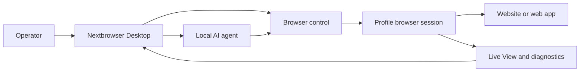

<!-- i18n-source-sha256: 7d99b995b47d93fc8a39fab53df59eab6cc4102b4b900d0d581d9ff8175bb1b5 -->

  

<h1 align="center">Nextbrowser</h1>

  <strong>Una consola de escritorio creada con Electron, React y TypeScript para ejecutar agentes de IA locales en sesiones de navegador administradas en macOS y Windows.</strong>

  <a href="https://nextbrowser.com/">Sitio web</a> ·
  <a href="https://docs.nextbrowser.com/">Documentación del producto</a> ·
  <a href="https://nextbrowser.com/use-cases">Casos de uso</a> ·
  <a href="https://github.com/nextbrowser-oss/nextbrowser-app/releases/latest">Descargar</a> ·
  <a href="https://github.com/nextbrowser-oss/nextbrowser-app/discussions">Discussions</a>

  
  
  

  <a href="../../../README.md">English</a> ·
  <strong>Español</strong> ·
  <a href="../pt-BR/README.md">Português (Brasil)</a> ·
  <a href="../zh-CN/README.md">简体中文</a> ·
  <a href="../ja/README.md">日本語</a> ·
  <a href="../ko/README.md">한국어</a> ·
  <a href="../de/README.md">Deutsch</a> ·
  <a href="../fr/README.md">Français</a> ·
  <a href="../ru/README.md">Русский</a> ·
  <a href="../uk/README.md">Українська</a> ·
  <a href="../ar/README.md">العربية</a> ·
  <a href="../hi/README.md">हिन्दी</a> ·
  <a href="../tr/README.md">Türkçe</a> ·
  <a href="../id/README.md">Bahasa Indonesia</a> ·
  <a href="../vi/README.md">Tiếng Việt</a> ·
  <a href="../th/README.md">ไทย</a> ·
  <a href="../it/README.md">Italiano</a> ·
  <a href="../pl/README.md">Polski</a> ·
  <a href="../nl/README.md">Nederlands</a> ·
  <a href="../fa/README.md">فارسی</a>

  

## Por qué Nextbrowser

El trabajo en el navegador realizado por un agente de IA abarca más que un prompt: un operador debe elegir una identidad de navegador, controlar la sesión, mantener observable el proceso del agente y recuperarse cuando una página o una ejecución falla. Nextbrowser reúne esos controles en una sola interfaz de escritorio.

- Mantén perfiles, sesiones, rotación de proxy/fingerprint y trabajo de agentes en una única vista operativa.
- Inspecciona la salida transmitida del agente y la actividad del navegador en lugar de tratar las ejecuciones como tareas que se lanzan y se olvidan.
- Reutiliza flujos de trabajo mediante skills, custom scripts, comprobaciones preflight y programaciones.
- Diagnostica el estado del navegador e invoca herramientas de captcha cuando una página presenta un desafío; nunca se garantiza que se resuelva correctamente.

## Funciones principales

| Área | Qué está disponible |
| --- | --- |
| Perfiles y sesiones | Gestiona perfiles, el ciclo de vida de las sesiones y la rotación de proxy/fingerprint. |
| Espacio de trabajo del agente | Ejecuta agentes locales con historial de Chat, colas, controles para detener/editar y forks de conversaciones. |
| Flujos de trabajo reutilizables | Aplica skills y custom scripts con preflight de la sesión del navegador. |
| Trabajo programado | Configura ejecuciones recurrentes de agentes y revísalas desde la consola de escritorio. |
| Visibilidad | Utiliza Live View, el estado de ejecución y los diagnósticos para inspeccionar el trabajo del navegador. |
| Herramientas de captcha | Detecta desafíos e invoca los flujos de tratamiento compatibles sin prometer un bypass. |

Consulta la [guía del producto](../../product-guide.md) para conocer los conceptos, las pantallas, los flujos de trabajo y las recomendaciones de operación.

## Inicio rápido

1. Descarga una compilación disponible para macOS o Windows desde la [última versión de Nextbrowser](https://github.com/nextbrowser-oss/nextbrowser-app/releases/latest).
2. Sigue la [documentación del producto](https://docs.nextbrowser.com/) para configurar el entorno del navegador y tu API key.
3. Abre Nextbrowser, selecciona un perfil, inicia su sesión, elige un agente local instalado y envía una tarea.
4. Mantén Chat y Live View abiertos mientras se ejecuta la tarea; detén, edita, pon en cola o crea un fork del trabajo cuando sea necesario.

Para consultar los controles del navegador y los diagnósticos, usa la [referencia correspondiente](../../cli-reference.md). Para configurar la aplicación y el navegador, consulta [configuración](../../configuration.md).

## Demos y casos de uso

Explora escenarios publicados en la [página de casos de uso de Nextbrowser](https://nextbrowser.com/use-cases). La vista previa anterior muestra la interfaz de NextBrowser en funcionamiento.

Los flujos de trabajo habituales incluyen:

- iniciar una sesión de perfil, asignar a un agente local una tarea de navegador y observar el progreso;
- aplicar una skill o un custom script privado después del preflight de la sesión;
- programar una tarea recurrente sin asignar al flujo una promesa de fecha de lanzamiento;
- inspeccionar el estado de la sesión, las pestañas, la página y la identidad cuando falla una ejecución;
- detectar un captcha y elegir una vía de gestión disponible, con intervención humana cuando sea necesaria.

## Cómo funciona

Nextbrowser es la superficie de control de escritorio. Los perfiles definen identidades del navegador, las sesiones proporcionan el contexto activo y la actividad permanece visible mediante Live View y los diagnósticos. Lee la [guía del producto](../../product-guide.md) para conocer el modelo completo.

## Documentación

- [Guía del producto](../../product-guide.md) — conceptos, pantallas, flujos de trabajo y seguridad.
- [Referencia de control del navegador](../../cli-reference.md) — operaciones y diagnósticos utilizados con Nextbrowser.
- [Configuración y desarrollo](../../../docs/configuration.md) — ajustes de la aplicación, estado local, notas de analítica y scripts de desarrollo.
- [Solución de problemas](../../troubleshooting.md) — diagnósticos desde la cuenta hasta la página y rutas habituales de recuperación.
- [Índice de idiomas](../README.md) — las 20 ediciones del README.

## Hoja de ruta

El trabajo de la hoja de ruta se sigue mediante [GitHub Issues](https://github.com/nextbrowser-oss/nextbrowser-app/issues) y tableros de proyecto. Un issue o una tarjeta de proyecto es una propuesta, no un compromiso de lanzamiento; no implica fechas.

## Contribuir

Lee [CONTRIBUTING.md](../../../CONTRIBUTING.md) antes de abrir un cambio. Utiliza los formularios estructurados de issues para bugs reproducibles, propuestas de funciones bien delimitadas, solicitudes de demos y correcciones de documentación. Los cambios del README deben mantener sincronizadas las 19 traducciones y el manifiesto i18n.

## Comunidad y soporte

- Únete al [Discord de Nextbrowser](https://discord.gg/jfYjwJQdQ) para conversar con la comunidad, obtener ayuda con la configuración y recibir novedades del producto.
- Haz preguntas generales y comparte ideas en [GitHub Discussions](https://github.com/nextbrowser-oss/nextbrowser-app/discussions).
- Utiliza [GitHub Issues](https://github.com/nextbrowser-oss/nextbrowser-app/issues) para trabajo accionable y bien delimitado.
- Sigue [SECURITY.md](../../../SECURITY.md) para informar vulnerabilidades de forma privada; no publiques detalles de seguridad en un issue.
- Empieza por [solución de problemas](../../troubleshooting.md) para problemas del runtime y de las sesiones del navegador.

## Licencia

Distribuido bajo la licencia **MIT**. Texto completo: [MIT License](../../../LICENSE).
