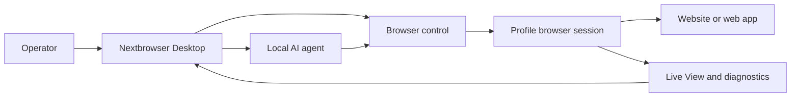

<!-- i18n-source-sha256: af4bcd2f6a6e0d0d097d0d490899d87da19f18d99ab163ce82c094c760efea99 -->

  

<h1 align="center">Nextbrowser</h1>

  <strong>کنسول دسکتاپ ساخته‌شده با Electron، React و TypeScript برای اجرای AI agentهای محلی در نشست‌های مدیریت‌شدهٔ مرورگر روی macOS و Windows.</strong>

  <a href="https://nextbrowser.com/">وب‌سایت</a> ·
  <a href="https://docs.nextbrowser.com/">مستندات محصول</a> ·
  <a href="https://nextbrowser.com/use-cases">موارد استفاده</a> ·
  <a href="https://github.com/nextbrowser-oss/nextbrowser-app/releases/latest">دانلود</a> ·
  <a href="https://github.com/nextbrowser-oss/nextbrowser-app/discussions">گفتگوها</a>

  
  
  

  <a href="../../../README.md">English</a> ·
  <a href="../es/README.md">Español</a> ·
  <a href="../pt-BR/README.md">Português (Brasil)</a> ·
  <a href="../zh-CN/README.md">简体中文</a> ·
  <a href="../ja/README.md">日本語</a> ·
  <a href="../ko/README.md">한국어</a> ·
  <a href="../de/README.md">Deutsch</a> ·
  <a href="../fr/README.md">Français</a> ·
  <a href="../ru/README.md">Русский</a> ·
  <a href="../uk/README.md">Українська</a> ·
  <a href="../ar/README.md">العربية</a> ·
  <a href="../hi/README.md">हिन्दी</a> ·
  <a href="../tr/README.md">Türkçe</a> ·
  <a href="../id/README.md">Bahasa Indonesia</a> ·
  <a href="../vi/README.md">Tiếng Việt</a> ·
  <a href="../th/README.md">ไทย</a> ·
  <a href="../it/README.md">Italiano</a> ·
  <a href="../pl/README.md">Polski</a> ·
  <a href="../nl/README.md">Nederlands</a> ·
  <strong>فارسی</strong>

  

## چرا Nextbrowser

کار AI agent در مرورگر فراتر از یک prompt است: اپراتور باید هویت مرورگر را انتخاب کند، نشست را کنترل کند، فرایند agent را زیر نظر داشته باشد و پس از خطای صفحه یا اجرا بازیابی کند. Nextbrowser این کنترل‌ها را در یک رابط دسکتاپ گرد هم می‌آورد.

- پروفایل‌ها، جلسه‌ها، چرخش proxy/fingerprint و کار عامل را در یک نمای عملیاتی نگه دارید.
- به‌جای رها کردن اجراها پس از شروع، خروجی جریانی عامل و فعالیت مرورگر را بررسی کنید.
- گردش‌های کاری را با skills، اسکریپت‌های سفارشی، بررسی‌های preflight و زمان‌بندی‌ها دوباره استفاده کنید.
- وضعیت مرورگر را عیب‌یابی و هنگام نمایش چالش توسط صفحه، ابزارهای captcha را فراخوانی کنید؛ حل موفق هرگز تضمین نمی‌شود.

## قابلیت‌های اصلی

| حوزه | امکانات موجود |
| --- | --- |
| پروفایل‌ها و جلسه‌ها | مدیریت پروفایل‌ها، چرخه عمر جلسه و چرخش proxy/fingerprint. |
| فضای کاری عامل | اجرای عامل‌های محلی با تاریخچه Chat، صف‌ها، کنترل‌های توقف/ویرایش و انشعاب‌های گفتگو. |
| گردش‌های کاری قابل استفاده مجدد | اعمال skills و اسکریپت‌های سفارشی همراه با preflight جلسه مرورگر. |
| کار زمان‌بندی‌شده | پیکربندی اجرای دوره‌ای عامل‌ها و بررسی آن‌ها از طریق کنسول دسکتاپ. |
| مشاهده‌پذیری | برای بررسی کار مرورگر از Live View، وضعیت اجرا و اطلاعات تشخیصی استفاده کنید. |
| ابزارهای کپچا | چالش‌ها را تشخیص دهید و مسیرهای پشتیبانی‌شده را بدون تضمین دور زدن اجرا کنید. |

برای مفاهیم، صفحه‌ها، گردش‌های کاری و راهنمای بهره‌برداری به [راهنمای محصول](../../product-guide.md) مراجعه کنید.

## شروع سریع

1. یک build موجود برای macOS یا Windows را از [آخرین انتشار Nextbrowser](https://github.com/nextbrowser-oss/nextbrowser-app/releases/latest) دانلود کنید.
2. برای پیکربندی محیط مرورگر و API key از [مستندات محصول](https://docs.nextbrowser.com/) پیروی کنید.
3. Nextbrowser را باز کنید، یک پروفایل برگزینید، جلسه آن را آغاز کنید، یک عامل محلی نصب‌شده را انتخاب کنید و یک وظیفه بفرستید.
4. هنگام اجرای وظیفه، Chat و Live View را باز نگه دارید؛ در صورت نیاز کار را متوقف، ویرایش، صف‌بندی یا منشعب کنید.

برای کنترل مرورگر و عیب‌یابی، [مرجع کنترل مرورگر](../../cli-reference.md) را ببینید. برای تنظیمات برنامه و مرورگر به [پیکربندی](../../configuration.md) مراجعه کنید.

## دموها و موارد استفاده

سناریوهای منتشرشده را در [صفحه موارد استفاده Nextbrowser](https://nextbrowser.com/use-cases) ببینید. پیش‌نمایش بالا رابط NextBrowser را هنگام کار نشان می‌دهد.

گردش‌کارهای رایج شامل این موارد است:

- آغاز یک جلسه پروفایل، دادن وظیفه مرورگر به یک عامل محلی و مشاهده پیشرفت؛
- اعمال یک skill یا اسکریپت سفارشی خصوصی پس از preflight جلسه؛
- زمان‌بندی یک وظیفه تکرارشونده بدون نسبت دادن وعده تاریخ انتشار به گردش کار؛
- بررسی وضعیت جلسه، زبانه، صفحه و هویت هنگام شکست اجرا؛
- تشخیص captcha و انتخاب یک مسیر رسیدگی موجود، همراه با مداخله انسانی در صورت نیاز.

## سازوکار

Nextbrowser سطح کنترل دسکتاپ است. پروفایل‌ها هویت مرورگر را تعریف می‌کنند، نشست‌ها زمینهٔ فعال را فراهم می‌کنند و فعالیت از طریق Live View و اطلاعات تشخیصی قابل مشاهده می‌ماند. مدل کامل را در [راهنمای محصول](../../product-guide.md) بخوانید.

## مستندات

- [راهنمای محصول](../../product-guide.md) — مفاهیم، صفحه‌ها، گردش‌های کاری و ایمنی.
- [مرجع کنترل مرورگر](../../cli-reference.md) — عملیات مرورگر و اطلاعات تشخیصی مورد استفاده با Nextbrowser.
- [پیکربندی و توسعه](../../../docs/configuration.md) — تنظیمات برنامه، وضعیت محلی، نکات تحلیل و اسکریپت‌های توسعه.
- [عیب‌یابی](../../troubleshooting.md) — عیب‌یابی از حساب تا صفحه و مسیرهای رایج بازیابی.
- [فهرست زبان‌ها](../README.md) — هر ۲۰ نسخه README.

## نقشه راه

کارهای roadmap از طریق [GitHub Issues](https://github.com/nextbrowser-oss/nextbrowser-app/issues) و بردهای پروژه پیگیری می‌شود. Issue یا کارت پروژه یک پیشنهاد است، نه تعهد انتشار؛ هیچ تاریخی را تضمین نمی‌کند.

## مشارکت

پیش از باز کردن یک تغییر، [CONTRIBUTING.md](../../../CONTRIBUTING.md) را بخوانید. برای باگ‌های قابل بازتولید، پیشنهادهای متمرکز قابلیت، درخواست‌های دمو و اصلاح مستندات از فرم‌های ساختاریافته issue استفاده کنید. تغییرات README باید هر ۱۹ ترجمه و i18n manifest را همگام نگه دارند.

## جامعه و پشتیبانی

- پرسش‌های عمومی را مطرح و ایده‌ها را در [GitHub Discussions](https://github.com/nextbrowser-oss/nextbrowser-app/discussions) به اشتراک بگذارید.
- برای کارهای اقدام‌پذیر و دارای محدوده مشخص از [GitHub Issues](https://github.com/nextbrowser-oss/nextbrowser-app/issues) استفاده کنید.
- برای گزارش خصوصی آسیب‌پذیری از [SECURITY.md](../../../SECURITY.md) پیروی کنید؛ جزئیات امنیتی را در issue منتشر نکنید.
- برای مشکلات runtime و جلسه مرورگر از [عیب‌یابی](../../troubleshooting.md) آغاز کنید.

## مجوز

تحت مجوز **MIT** توزیع می‌شود. متن کامل: [opensource.org/licenses/MIT](https://opensource.org/licenses/MIT).
