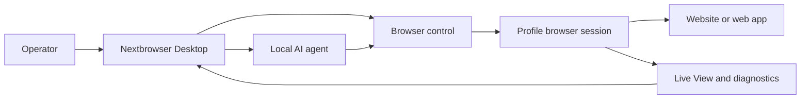

<!-- i18n-source-sha256: af4bcd2f6a6e0d0d097d0d490899d87da19f18d99ab163ce82c094c760efea99 -->

  

<h1 align="center">Nextbrowser</h1>

  <strong>Une console de bureau Electron, React et TypeScript permettant d’exécuter des agents IA locaux dans des sessions de navigateur gérées sous macOS et Windows.</strong>

  <a href="https://nextbrowser.com/">Site web</a> ·
  <a href="https://docs.nextbrowser.com/">Documentation du produit</a> ·
  <a href="https://nextbrowser.com/use-cases">Cas d’usage</a> ·
  <a href="https://github.com/nextbrowser-oss/nextbrowser-app/releases/latest">Télécharger</a> ·
  <a href="https://github.com/nextbrowser-oss/nextbrowser-app/discussions">Discussions</a>

  
  
  

  <a href="../../../README.md">English</a> ·
  <a href="../es/README.md">Español</a> ·
  <a href="../pt-BR/README.md">Português (Brasil)</a> ·
  <a href="../zh-CN/README.md">简体中文</a> ·
  <a href="../ja/README.md">日本語</a> ·
  <a href="../ko/README.md">한국어</a> ·
  <a href="../de/README.md">Deutsch</a> ·
  <strong>Français</strong> ·
  <a href="../ru/README.md">Русский</a> ·
  <a href="../uk/README.md">Українська</a> ·
  <a href="../ar/README.md">العربية</a> ·
  <a href="../hi/README.md">हिन्दी</a> ·
  <a href="../tr/README.md">Türkçe</a> ·
  <a href="../id/README.md">Bahasa Indonesia</a> ·
  <a href="../vi/README.md">Tiếng Việt</a> ·
  <a href="../th/README.md">ไทย</a> ·
  <a href="../it/README.md">Italiano</a> ·
  <a href="../pl/README.md">Polski</a> ·
  <a href="../nl/README.md">Nederlands</a> ·
  <a href="../fa/README.md">فارسی</a>

  

## Pourquoi Nextbrowser

Le travail d’un agent IA dans le navigateur va au-delà d’un prompt : l’opérateur doit choisir une identité de navigateur, contrôler la session, observer le processus de l’agent et reprendre après l’échec d’une page ou d’une exécution. Nextbrowser réunit ces contrôles dans une seule interface de bureau.

- Regroupez les profils, les sessions, la rotation proxy/fingerprint et le travail des agents dans une même vue opérationnelle.
- Examinez la sortie diffusée de l’agent et l’activité du navigateur au lieu de traiter les exécutions comme des tâches lancées puis oubliées.
- Réutilisez les workflows grâce aux skills, aux custom scripts, aux vérifications preflight et aux planifications.
- Diagnostiquez l’état du navigateur et invoquez les outils de captcha lorsqu’une page présente un défi ; la résolution n’est jamais garantie.

## Fonctionnalités principales

| Domaine | Fonctionnalités disponibles |
| --- | --- |
| Profils et sessions | Gérez les profils, le cycle de vie des sessions et la rotation proxy/fingerprint. |
| Espace de travail de l’agent | Exécutez des agents locaux avec historique de Chat, files d’attente, commandes d’arrêt/modification et forks de conversations. |
| Workflows réutilisables | Appliquez des skills et des custom scripts avec un preflight de la session du navigateur. |
| Travail planifié | Configurez des exécutions récurrentes d’agents et examinez-les depuis la console de bureau. |
| Visibilité | Utilisez Live View, l’état d’exécution et les diagnostics pour examiner le travail du navigateur. |
| Outils de captcha | Détectez les défis et lancez les parcours de traitement pris en charge, sans garantie de contournement. |

Consultez le [guide du produit](../../product-guide.md) pour découvrir les concepts, les écrans, les workflows et les recommandations d’exploitation.

## Démarrage rapide

1. Téléchargez un build disponible pour macOS ou Windows depuis la [dernière version de Nextbrowser](https://github.com/nextbrowser-oss/nextbrowser-app/releases/latest).
2. Suivez la [documentation du produit](https://docs.nextbrowser.com/) pour configurer l’environnement du navigateur et votre API key.
3. Ouvrez Nextbrowser, sélectionnez un profil, démarrez sa session, choisissez un agent local installé et soumettez une tâche.
4. Gardez Chat et Live View ouverts pendant l’exécution de la tâche ; arrêtez, modifiez, mettez en file d’attente ou créez un fork du travail selon vos besoins.

Pour le contrôle du navigateur et les diagnostics, consultez la [référence correspondante](../../cli-reference.md). Pour la configuration de l’application et du navigateur, consultez la [configuration](../../configuration.md).

## Démos et cas d’usage

Découvrez les scénarios publiés sur la [page des cas d’usage Nextbrowser](https://nextbrowser.com/use-cases). L’aperçu ci-dessus montre l’interface NextBrowser en action.

Les workflows courants comprennent :

- démarrer une session de profil, confier une tâche de navigation à un agent local et observer sa progression ;
- appliquer une skill ou un custom script privé après le preflight de la session ;
- planifier une tâche récurrente sans associer au workflow une promesse de date de sortie ;
- inspecter l’état de la session, des onglets, de la page et de l’identité lorsqu’une exécution échoue ;
- détecter un captcha et choisir un parcours de traitement disponible, avec une intervention humaine si nécessaire.

## Fonctionnement

Nextbrowser est la surface de contrôle de bureau. Les profils définissent les identités du navigateur, les sessions fournissent le contexte actif et l’activité reste visible dans Live View et les diagnostics. Consultez le [guide produit](../../product-guide.md) pour le modèle complet.

## Documentation

- [Guide du produit](../../product-guide.md) — concepts, écrans, workflows et sécurité.
- [Référence du contrôle du navigateur](../../cli-reference.md) — opérations et diagnostics utilisés avec Nextbrowser.
- [Configuration et développement](../../../docs/configuration.md) — paramètres de l’application, état local, notes d’analytique et scripts de développement.
- [Dépannage](../../troubleshooting.md) — diagnostics du compte à la page et parcours de rétablissement courants.
- [Index des langues](../README.md) — les 20 éditions du README.

## Roadmap

Le travail de roadmap est suivi dans les [GitHub Issues](https://github.com/nextbrowser-oss/nextbrowser-app/issues) et les tableaux de projet. Une issue ou une carte de projet est une proposition, pas un engagement de livraison ; aucune date n’est implicite.

## Contribuer

Lisez [CONTRIBUTING.md](../../../CONTRIBUTING.md) avant de proposer une modification. Utilisez les Issue Forms structurés pour les bugs reproductibles, les propositions de fonctionnalités ciblées, les demandes de démos et les corrections de documentation. Toute modification du README doit maintenir les 19 traductions et le manifeste i18n synchronisés.

## Communauté et assistance

- Posez vos questions générales et partagez vos idées dans [GitHub Discussions](https://github.com/nextbrowser-oss/nextbrowser-app/discussions).
- Utilisez les [GitHub Issues](https://github.com/nextbrowser-oss/nextbrowser-app/issues) pour un travail exploitable et bien délimité.
- Suivez [SECURITY.md](../../../SECURITY.md) pour signaler une vulnérabilité en privé ; ne publiez pas de détails de sécurité dans un issue.
- Commencez par le [dépannage](../../troubleshooting.md) pour les problèmes de runtime et de sessions de navigateur.

## Licence

Distribué sous licence **MIT**. Texte intégral : [opensource.org/licenses/MIT](https://opensource.org/licenses/MIT).
