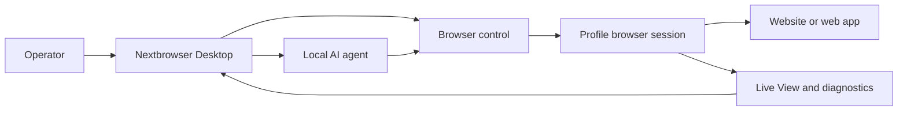

<!-- i18n-source-sha256: 7d99b995b47d93fc8a39fab53df59eab6cc4102b4b900d0d581d9ff8175bb1b5 -->

  

<h1 align="center">Nextbrowser</h1>

  <strong>macOS और Windows पर प्रबंधित ब्राउज़र सेशन में स्थानीय AI agents चलाने के लिए Electron, React और TypeScript से बना डेस्कटॉप कंसोल।</strong>

  <a href="https://nextbrowser.com/">वेबसाइट</a> ·
  <a href="https://docs.nextbrowser.com/">उत्पाद दस्तावेज़</a> ·
  <a href="https://nextbrowser.com/use-cases">उपयोग के उदाहरण</a> ·
  <a href="https://github.com/nextbrowser-oss/nextbrowser-app/releases/latest">डाउनलोड</a> ·
  <a href="https://github.com/nextbrowser-oss/nextbrowser-app/discussions">चर्चाएँ</a>

  
  
  

  <a href="../../../README.md">English</a> ·
  <a href="../es/README.md">Español</a> ·
  <a href="../pt-BR/README.md">Português (Brasil)</a> ·
  <a href="../zh-CN/README.md">简体中文</a> ·
  <a href="../ja/README.md">日本語</a> ·
  <a href="../ko/README.md">한국어</a> ·
  <a href="../de/README.md">Deutsch</a> ·
  <a href="../fr/README.md">Français</a> ·
  <a href="../ru/README.md">Русский</a> ·
  <a href="../uk/README.md">Українська</a> ·
  <a href="../ar/README.md">العربية</a> ·
  <strong>हिन्दी</strong> ·
  <a href="../tr/README.md">Türkçe</a> ·
  <a href="../id/README.md">Bahasa Indonesia</a> ·
  <a href="../vi/README.md">Tiếng Việt</a> ·
  <a href="../th/README.md">ไทย</a> ·
  <a href="../it/README.md">Italiano</a> ·
  <a href="../pl/README.md">Polski</a> ·
  <a href="../nl/README.md">Nederlands</a> ·
  <a href="../fa/README.md">فارسی</a>

  

## Nextbrowser क्यों

AI agent का ब्राउज़र कार्य एक prompt से आगे जाता है: ऑपरेटर को ब्राउज़र पहचान चुननी होती है, session नियंत्रित करना होता है, agent प्रक्रिया पर नज़र रखनी होती है और पेज या रन विफल होने पर पुनर्प्राप्ति करनी होती है। Nextbrowser इन सभी नियंत्रणों को एक डेस्कटॉप इंटरफ़ेस में लाता है।

- Profile, session, proxy/fingerprint rotation और agent कार्य को एक operational view में रखें।
- Run को शुरू करके छोड़ देने के बजाय streamed agent output और browser activity का निरीक्षण करें।
- Skill, custom script, preflight check और schedule के माध्यम से workflow दोबारा इस्तेमाल करें।
- Page पर challenge आने पर browser state का diagnosis करें और captcha tools चलाएँ; सफल समाधान की कोई guarantee नहीं है।

## प्रमुख विशेषताएँ

| क्षेत्र | उपलब्ध सुविधा |
| --- | --- |
| Profile और session | profile, session lifecycle और proxy/fingerprint rotation प्रबंधित करें। |
| Agent workspace | chat history, queue, stop/edit controls और conversation fork के साथ local agent चलाएँ। |
| दोबारा इस्तेमाल होने वाले workflow | browser-session preflight के साथ skill और custom script लागू करें। |
| Scheduled work | बार-बार होने वाले agent run configure करें और desktop console से उनकी समीक्षा करें। |
| दृश्यता | ब्राउज़र कार्य की जाँच के लिए Live View, रन स्थिति और diagnostics का उपयोग करें। |
| Captcha टूल | चुनौतियों का पता लगाएँ और समर्थित handling flows चलाएँ; bypass की कोई गारंटी नहीं है। |

Concepts, screens, workflows और संचालन संबंधी मार्गदर्शन के लिए [product guide](../../product-guide.md) देखें।

## तुरंत शुरू करें

1. [Nextbrowser के नवीनतम release](https://github.com/nextbrowser-oss/nextbrowser-app/releases/latest) से उपलब्ध macOS या Windows build डाउनलोड करें।
2. ब्राउज़र वातावरण और API key कॉन्फ़िगर करने के लिए [product documentation](https://docs.nextbrowser.com/) का पालन करें।
3. Nextbrowser खोलें, profile चुनें, उसका session शुरू करें, installed local agent चुनें और task submit करें।
4. Task चलते समय Chat और Live View खुले रखें; आवश्यकता होने पर काम को stop, edit, queue या fork करें।

ब्राउज़र नियंत्रण और diagnostics के लिए [browser control reference](../../cli-reference.md) देखें। ऐप और ब्राउज़र कॉन्फ़िगरेशन के लिए [configuration](../../configuration.md) देखें।

## Demo और उपयोग के उदाहरण

प्रकाशित परिदृश्य [Nextbrowser उपयोग-मामला पेज](https://nextbrowser.com/use-cases) पर देखें। ऊपर का पूर्वावलोकन NextBrowser इंटरफ़ेस को कार्य करते हुए दिखाता है।

सामान्य वर्कफ़्लो में शामिल हैं:

- profile session शुरू करना, local agent को browser task देना और progress देखना;
- session preflight के बाद skill या private custom script लागू करना;
- workflow के लिए किसी release date का वादा किए बिना recurring task schedule करना;
- run विफल होने पर session, tab, page और identity state देखना;
- captcha detect करना और उपलब्ध handling path चुनना, तथा आवश्यकता होने पर human intervention लेना।

## यह कैसे काम करता है

Nextbrowser डेस्कटॉप नियंत्रण सतह है। Profiles ब्राउज़र पहचान तय करते हैं, sessions सक्रिय ब्राउज़र संदर्भ देते हैं और गतिविधि Live View तथा diagnostics में दिखाई देती है। पूरा मॉडल [product guide](../../product-guide.md) में देखें।

## दस्तावेज़

- [Product guide](../../product-guide.md) — concepts, screens, workflows और safety।
- [Browser control reference](../../cli-reference.md) — Nextbrowser के साथ उपयोग होने वाले ब्राउज़र operations और diagnostics।
- [कॉन्फ़िगरेशन और डेवलपमेंट](../../../docs/configuration.md) — एप्लिकेशन सेटिंग, स्थानीय स्थिति, एनालिटिक्स नोट्स और डेवलपमेंट स्क्रिप्ट।
- [Troubleshooting](../../troubleshooting.md) — account से page तक diagnostics और सामान्य recovery path।
- [Language index](../README.md) — README के सभी 20 भाषा संस्करण।

## Roadmap

रोडमैप कार्य को [GitHub Issues](https://github.com/nextbrowser-oss/nextbrowser-app/issues) और प्रोजेक्ट बोर्ड के माध्यम से ट्रैक किया जाता है। कोई issue या प्रोजेक्ट कार्ड प्रस्ताव है, रिलीज़ की प्रतिबद्धता नहीं; कोई तारीख निहित नहीं है।

## योगदान

Change खोलने से पहले [CONTRIBUTING.md](../../../CONTRIBUTING.md) पढ़ें। Reproducible bug, focused feature proposal, demo request और documentation fix के लिए structured issue forms का उपयोग करें। README change के साथ सभी 19 translations और i18n manifest को synchronized रखना आवश्यक है।

## समुदाय और सहायता

- समुदाय से बातचीत, सेटअप सहायता और उत्पाद अपडेट के लिए [Nextbrowser Discord](https://discord.gg/jfYjwJQdQ) से जुड़ें।
- सामान्य प्रश्न पूछने और विचार साझा करने के लिए [GitHub Discussions](https://github.com/nextbrowser-oss/nextbrowser-app/discussions) का उपयोग करें।
- Actionable और स्पष्ट दायरे वाले कार्य के लिए [GitHub Issues](https://github.com/nextbrowser-oss/nextbrowser-app/issues) का उपयोग करें।
- Vulnerability की private reporting के लिए [SECURITY.md](../../../SECURITY.md) का पालन करें; issue में security details प्रकाशित न करें।
- Runtime और browser-session समस्याओं के लिए पहले [troubleshooting](../../troubleshooting.md) देखें।

## License

**MIT** लाइसेंस के अंतर्गत वितरित। पूरा पाठ: [MIT License](../../../LICENSE)।
