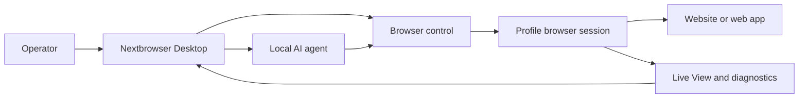

<!-- i18n-source-sha256: af4bcd2f6a6e0d0d097d0d490899d87da19f18d99ab163ce82c094c760efea99 -->

  

<h1 align="center">Nextbrowser</h1>

  <strong>Konsol desktop berbasis Electron, React, dan TypeScript untuk menjalankan AI agent lokal dalam sesi browser terkelola di macOS dan Windows.</strong>

  <a href="https://nextbrowser.com/">Situs web</a> ·
  <a href="https://docs.nextbrowser.com/">Dokumentasi produk</a> ·
  <a href="https://nextbrowser.com/use-cases">Kasus penggunaan</a> ·
  <a href="https://github.com/nextbrowser-oss/nextbrowser-app/releases/latest">Unduh</a> ·
  <a href="https://github.com/nextbrowser-oss/nextbrowser-app/discussions">Diskusi</a>

  
  
  

  <a href="../../../README.md">English</a> ·
  <a href="../es/README.md">Español</a> ·
  <a href="../pt-BR/README.md">Português (Brasil)</a> ·
  <a href="../zh-CN/README.md">简体中文</a> ·
  <a href="../ja/README.md">日本語</a> ·
  <a href="../ko/README.md">한국어</a> ·
  <a href="../de/README.md">Deutsch</a> ·
  <a href="../fr/README.md">Français</a> ·
  <a href="../ru/README.md">Русский</a> ·
  <a href="../uk/README.md">Українська</a> ·
  <a href="../ar/README.md">العربية</a> ·
  <a href="../hi/README.md">हिन्दी</a> ·
  <a href="../tr/README.md">Türkçe</a> ·
  <strong>Bahasa Indonesia</strong> ·
  <a href="../vi/README.md">Tiếng Việt</a> ·
  <a href="../th/README.md">ไทย</a> ·
  <a href="../it/README.md">Italiano</a> ·
  <a href="../pl/README.md">Polski</a> ·
  <a href="../nl/README.md">Nederlands</a> ·
  <a href="../fa/README.md">فارسی</a>

  

## Mengapa Nextbrowser

Pekerjaan browser oleh AI agent mencakup lebih dari satu prompt: operator harus memilih identitas browser, mengontrol sesi, mengamati proses agent, dan memulihkan pekerjaan saat halaman atau eksekusi gagal. Nextbrowser menyatukan semua kontrol tersebut dalam satu antarmuka desktop.

- Kelola profil, sesi, rotasi proxy/fingerprint, dan pekerjaan agen dalam satu tampilan operasional.
- Periksa keluaran agen yang dialirkan dan aktivitas browser alih-alih menjalankan proses tanpa pemantauan.
- Gunakan kembali alur kerja melalui skills, skrip khusus, pemeriksaan preflight, dan jadwal.
- Diagnosis status browser dan jalankan alat captcha saat halaman menampilkan tantangan; penyelesaian yang berhasil tidak pernah dijamin.

## Fitur utama

| Area | Yang tersedia |
| --- | --- |
| Profil dan sesi | Kelola profil, siklus hidup sesi, dan rotasi proxy/fingerprint. |
| Ruang kerja agen | Jalankan agen lokal dengan riwayat Chat, antrean, kendali berhenti/edit, dan percabangan percakapan. |
| Alur kerja yang dapat digunakan kembali | Terapkan skills dan skrip khusus dengan preflight sesi browser. |
| Pekerjaan terjadwal | Konfigurasikan proses agen berulang dan tinjau dari konsol desktop. |
| Visibilitas | Gunakan Live View, status eksekusi, dan diagnostik untuk memeriksa pekerjaan browser. |
| Alat captcha | Deteksi tantangan dan jalankan alur penanganan yang didukung tanpa jaminan bypass. |

Lihat [panduan produk](../../product-guide.md) untuk konsep, layar, alur kerja, dan panduan operasional.

## Mulai Cepat

1. Unduh build macOS atau Windows yang tersedia dari [rilis Nextbrowser terbaru](https://github.com/nextbrowser-oss/nextbrowser-app/releases/latest).
2. Ikuti [dokumentasi produk](https://docs.nextbrowser.com/) untuk mengonfigurasi lingkungan browser dan API key Anda.
3. Buka Nextbrowser, pilih profil, mulai sesinya, pilih agen lokal yang telah terpasang, lalu kirim tugas.
4. Biarkan Chat dan Live View terbuka saat tugas berjalan; hentikan, edit, antrekan, atau cabangkan pekerjaan bila perlu.

Untuk kontrol browser dan diagnostik, gunakan [referensi kontrol browser](../../cli-reference.md). Untuk konfigurasi aplikasi dan browser, lihat [konfigurasi](../../configuration.md).

## Demo dan kasus penggunaan

Jelajahi skenario yang dipublikasikan di [halaman kasus penggunaan Nextbrowser](https://nextbrowser.com/use-cases). Pratinjau di atas menampilkan antarmuka NextBrowser saat digunakan.

Alur kerja umum meliputi:

- memulai sesi profil, memberi agen lokal tugas browser, dan mengamati kemajuannya;
- menerapkan skill atau skrip khusus privat setelah preflight sesi;
- menjadwalkan tugas berulang tanpa mengaitkan janji tanggal rilis dengan alur kerja;
- memeriksa status sesi, tab, halaman, dan identitas saat proses gagal;
- mendeteksi captcha dan memilih jalur penanganan yang tersedia, dengan intervensi manusia bila diperlukan.

## Cara kerjanya

Nextbrowser adalah permukaan kontrol desktop. Profil menentukan identitas browser, sesi menyediakan konteks browser aktif, dan aktivitas tetap terlihat melalui Live View serta diagnostik. Baca [panduan produk](../../product-guide.md) untuk memahami model lengkapnya.

## Dokumentasi

- [Panduan produk](../../product-guide.md) — konsep, layar, alur kerja, dan keselamatan.
- [Referensi kontrol browser](../../cli-reference.md) — operasi browser dan diagnostik yang digunakan bersama Nextbrowser.
- [Konfigurasi dan pengembangan](../../../docs/configuration.md) — pengaturan aplikasi, status lokal, catatan analitik, dan skrip pengembangan.
- [Pemecahan masalah](../../troubleshooting.md) — diagnosis dari akun hingga halaman dan jalur pemulihan umum.
- [Indeks bahasa](../README.md) — seluruh 20 edisi README.

## Peta jalan

Pekerjaan roadmap dilacak melalui [GitHub Issues](https://github.com/nextbrowser-oss/nextbrowser-app/issues) dan papan proyek. Issue atau kartu proyek adalah proposal, bukan komitmen rilis; tidak menyiratkan tanggal.

## Berkontribusi

Baca [CONTRIBUTING.md](../../../CONTRIBUTING.md) sebelum membuka perubahan. Gunakan formulir issue terstruktur untuk bug yang dapat direproduksi, usulan fitur yang terfokus, permintaan demo, dan perbaikan dokumentasi. Perubahan README harus menjaga seluruh 19 terjemahan dan manifest i18n tetap tersinkronisasi.

## Komunitas dan dukungan

- Ajukan pertanyaan umum dan bagikan ide di [GitHub Discussions](https://github.com/nextbrowser-oss/nextbrowser-app/discussions).
- Gunakan [GitHub Issues](https://github.com/nextbrowser-oss/nextbrowser-app/issues) untuk pekerjaan yang dapat ditindaklanjuti dan memiliki cakupan jelas.
- Ikuti [SECURITY.md](../../../SECURITY.md) untuk pelaporan kerentanan secara privat; jangan publikasikan detail keamanan dalam issue.
- Mulailah dari [pemecahan masalah](../../troubleshooting.md) untuk masalah runtime dan sesi browser.

## Lisensi

Didistribusikan di bawah lisensi **MIT**. Teks lengkap: [opensource.org/licenses/MIT](https://opensource.org/licenses/MIT).
