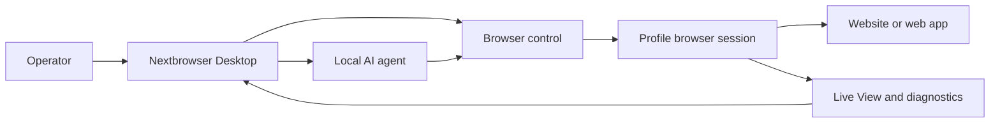

<!-- i18n-source-sha256: af4bcd2f6a6e0d0d097d0d490899d87da19f18d99ab163ce82c094c760efea99 -->

  

<h1 align="center">Nextbrowser</h1>

  <strong>Una console desktop basata su Electron, React e TypeScript per eseguire agenti AI locali in sessioni browser gestite su macOS e Windows.</strong>

  <a href="https://nextbrowser.com/">Sito web</a> ·
  <a href="https://docs.nextbrowser.com/">Documentazione del prodotto</a> ·
  <a href="https://nextbrowser.com/use-cases">Casi d’uso</a> ·
  <a href="https://github.com/nextbrowser-oss/nextbrowser-app/releases/latest">Download</a> ·
  <a href="https://github.com/nextbrowser-oss/nextbrowser-app/discussions">Discussions</a>

  
  
  

  <a href="../../../README.md">English</a> ·
  <a href="../es/README.md">Español</a> ·
  <a href="../pt-BR/README.md">Português (Brasil)</a> ·
  <a href="../zh-CN/README.md">简体中文</a> ·
  <a href="../ja/README.md">日本語</a> ·
  <a href="../ko/README.md">한국어</a> ·
  <a href="../de/README.md">Deutsch</a> ·
  <a href="../fr/README.md">Français</a> ·
  <a href="../ru/README.md">Русский</a> ·
  <a href="../uk/README.md">Українська</a> ·
  <a href="../ar/README.md">العربية</a> ·
  <a href="../hi/README.md">हिन्दी</a> ·
  <a href="../tr/README.md">Türkçe</a> ·
  <a href="../id/README.md">Bahasa Indonesia</a> ·
  <a href="../vi/README.md">Tiếng Việt</a> ·
  <a href="../th/README.md">ไทย</a> ·
  <strong>Italiano</strong> ·
  <a href="../pl/README.md">Polski</a> ·
  <a href="../nl/README.md">Nederlands</a> ·
  <a href="../fa/README.md">فارسی</a>

  

## Perché Nextbrowser

Il lavoro di un agente AI nel browser va oltre un singolo prompt: l’operatore deve scegliere un’identità del browser, controllare la sessione, osservare il processo dell’agente e ripristinare il lavoro quando una pagina o un’esecuzione fallisce. Nextbrowser riunisce questi controlli in un’unica interfaccia desktop.

- Mantieni profili, sessioni, rotazione proxy/fingerprint e lavoro degli agenti in un’unica vista operativa.
- Esamina l’output in streaming dell’agente e l’attività del browser invece di trattare le esecuzioni come operazioni da avviare e dimenticare.
- Riutilizza i workflow tramite skills, custom scripts, controlli preflight e pianificazioni.
- Diagnostica lo stato del browser e richiama gli strumenti captcha quando una pagina presenta una sfida; la risoluzione non è mai garantita.

## Funzionalità principali

| Area | Funzionalità disponibili |
| --- | --- |
| Profili e sessioni | Gestisci profili, ciclo di vita delle sessioni e rotazione proxy/fingerprint. |
| Spazio di lavoro dell’agente | Esegui agenti locali con cronologia Chat, code, controlli di arresto/modifica e fork delle conversazioni. |
| Workflow riutilizzabili | Applica skills e custom scripts con il preflight della sessione del browser. |
| Lavoro pianificato | Configura esecuzioni ricorrenti degli agenti e controllale dalla console desktop. |
| Visibilità | Usa Live View, lo stato dell’esecuzione e la diagnostica per controllare il lavoro nel browser. |
| Strumenti captcha | Rileva le verifiche e avvia i flussi di gestione supportati senza garantire il bypass. |

Consulta la [guida del prodotto](../../product-guide.md) per concetti, schermate, workflow e indicazioni operative.

## Avvio rapido

1. Scarica una build disponibile per macOS o Windows dall’[ultima release di Nextbrowser](https://github.com/nextbrowser-oss/nextbrowser-app/releases/latest).
2. Segui la [documentazione del prodotto](https://docs.nextbrowser.com/) per configurare l’ambiente del browser e la tua API key.
3. Apri Nextbrowser, seleziona un profilo, avviane la sessione, scegli un agente locale installato e invia un’attività.
4. Mantieni aperti Chat e Live View durante l’esecuzione; arresta, modifica, accoda o crea un fork del lavoro quando necessario.

Per i controlli del browser e la diagnostica, consulta il [riferimento dedicato](../../cli-reference.md). Per configurare l’applicazione e il browser, consulta la [configurazione](../../configuration.md).

## Demo e casi d’uso

Esplora gli scenari pubblicati nella [pagina dei casi d’uso di Nextbrowser](https://nextbrowser.com/use-cases). L’anteprima qui sopra mostra l’interfaccia NextBrowser in azione.

I flussi di lavoro comuni includono:

- avviare la sessione di un profilo, assegnare a un agente locale un’attività nel browser e osservarne l’avanzamento;
- applicare una skill o un custom script privato dopo il preflight della sessione;
- pianificare un’attività ricorrente senza associare al workflow una promessa sulla data di rilascio;
- esaminare lo stato di sessione, schede, pagina e identità quando un’esecuzione non riesce;
- rilevare un captcha e scegliere un percorso di gestione disponibile, con intervento umano quando necessario.

## Come funziona

Nextbrowser è la superficie di controllo desktop. I profili definiscono le identità del browser, le sessioni forniscono il contesto attivo e l’attività rimane visibile tramite Live View e la diagnostica. Leggi la [guida del prodotto](../../product-guide.md) per il modello completo.

## Documentazione

- [Guida del prodotto](../../product-guide.md) — concetti, schermate, workflow e sicurezza.
- [Riferimento per il controllo del browser](../../cli-reference.md) — operazioni e diagnostica utilizzate con Nextbrowser.
- [Configurazione e sviluppo](../../../docs/configuration.md) — impostazioni dell’applicazione, stato locale, note di analytics e script di sviluppo.
- [Risoluzione dei problemi](../../troubleshooting.md) — diagnostica dall’account alla pagina e percorsi di ripristino comuni.
- [Indice delle lingue](../README.md) — tutte le 20 edizioni del README.

## Roadmap

Il lavoro sulla roadmap viene tracciato tramite [GitHub Issues](https://github.com/nextbrowser-oss/nextbrowser-app/issues) e board di progetto. Una issue o scheda di progetto è una proposta, non un impegno di rilascio; non implica date.

## Contribuire

Leggi [CONTRIBUTING.md](../../../CONTRIBUTING.md) prima di proporre una modifica. Usa gli Issue Forms strutturati per bug riproducibili, proposte di funzionalità ben delimitate, richieste di demo e correzioni alla documentazione. Le modifiche al README devono mantenere sincronizzate tutte le 19 traduzioni e il manifest i18n.

## Community e supporto

- Fai domande generali e condividi idee in [GitHub Discussions](https://github.com/nextbrowser-oss/nextbrowser-app/discussions).
- Usa [GitHub Issues](https://github.com/nextbrowser-oss/nextbrowser-app/issues) per attività concrete e ben delimitate.
- Segui [SECURITY.md](../../../SECURITY.md) per segnalare privatamente le vulnerabilità; non pubblicare dettagli di sicurezza in un issue.
- Inizia dalla [risoluzione dei problemi](../../troubleshooting.md) per i problemi di runtime e delle sessioni del browser.

## Licenza

Distribuito con licenza **MIT**. Testo completo: [opensource.org/licenses/MIT](https://opensource.org/licenses/MIT).
