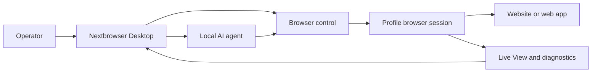

<!-- i18n-source-sha256: af4bcd2f6a6e0d0d097d0d490899d87da19f18d99ab163ce82c094c760efea99 -->

  

<h1 align="center">Nextbrowser</h1>

  <strong>macOS と Windows で、管理されたブラウザセッション内のローカル AI エージェントを実行するための Electron、React、TypeScript 製デスクトップコンソールです。</strong>

  <a href="https://nextbrowser.com/">ウェブサイト</a> ·
  <a href="https://docs.nextbrowser.com/">製品ドキュメント</a> ·
  <a href="https://nextbrowser.com/use-cases">ユースケース</a> ·
  <a href="https://github.com/nextbrowser-oss/nextbrowser-app/releases/latest">ダウンロード</a> ·
  <a href="https://github.com/nextbrowser-oss/nextbrowser-app/discussions">Discussions</a>

  
  
  

  <a href="../../../README.md">English</a> ·
  <a href="../es/README.md">Español</a> ·
  <a href="../pt-BR/README.md">Português (Brasil)</a> ·
  <a href="../zh-CN/README.md">简体中文</a> ·
  <strong>日本語</strong> ·
  <a href="../ko/README.md">한국어</a> ·
  <a href="../de/README.md">Deutsch</a> ·
  <a href="../fr/README.md">Français</a> ·
  <a href="../ru/README.md">Русский</a> ·
  <a href="../uk/README.md">Українська</a> ·
  <a href="../ar/README.md">العربية</a> ·
  <a href="../hi/README.md">हिन्दी</a> ·
  <a href="../tr/README.md">Türkçe</a> ·
  <a href="../id/README.md">Bahasa Indonesia</a> ·
  <a href="../vi/README.md">Tiếng Việt</a> ·
  <a href="../th/README.md">ไทย</a> ·
  <a href="../it/README.md">Italiano</a> ·
  <a href="../pl/README.md">Polski</a> ·
  <a href="../nl/README.md">Nederlands</a> ·
  <a href="../fa/README.md">فارسی</a>

  

## Nextbrowser を選ぶ理由

AI エージェントによるブラウザ作業は、単一のプロンプトだけでは完結しません。オペレーターはブラウザ ID を選択し、セッションを制御し、エージェントの処理を監視し、ページや実行の失敗から復旧する必要があります。Nextbrowser は、これらの操作を 1 つのデスクトップ画面にまとめます。

- profile、session、proxy/fingerprint rotation、エージェント作業を 1 つの運用ビューで管理できます。
- 実行を放置せず、ストリーミングされるエージェント出力とブラウザーアクティビティを確認できます。
- skill、custom script、preflight check、schedule を通じてワークフローを再利用できます。
- ページに challenge が表示されたときにブラウザー状態を診断して captcha ツールを呼び出せますが、解決の成功は保証されません。

## 主な機能

| 領域 | 利用できる機能 |
| --- | --- |
| Profile と session | profile、session のライフサイクル、proxy/fingerprint rotation を管理します。 |
| エージェントワークスペース | chat history、queue、停止/編集コントロール、conversation fork を使ってローカルエージェントを実行します。 |
| 再利用可能なワークフロー | browser-session preflight を伴う skill と custom script を適用します。 |
| スケジュール実行 | 定期的なエージェント実行を設定し、デスクトップコンソールから確認します。 |
| 可視性 | Live View、実行ステータス、診断情報を使ってブラウザ作業を確認します。 |
| CAPTCHA ツール | チャレンジを検出し、対応する処理フローを呼び出します。回避を保証するものではありません。 |

概念、画面、ワークフロー、運用ガイダンスについては[製品ガイド](../../product-guide.md)を参照してください。

## クイックスタート

1. [Nextbrowser の最新リリース](https://github.com/nextbrowser-oss/nextbrowser-app/releases/latest)から、利用可能な macOS または Windows ビルドをダウンロードします。
2. [製品ドキュメント](https://docs.nextbrowser.com/)に従って、ブラウザ環境と API key を設定します。
3. Nextbrowser を開き、profile を選択して session を開始し、インストール済みのローカルエージェントを選んでタスクを送信します。
4. タスクの実行中は Chat と Live View を開いたままにし、必要に応じて作業を停止、編集、queue、fork します。

ブラウザ操作と診断については[ブラウザ制御リファレンス](../../cli-reference.md)を、アプリケーションとブラウザの設定については[設定](../../configuration.md)を参照してください。

## デモとユースケース

公開済みのシナリオは [Nextbrowser のユースケースページ](https://nextbrowser.com/use-cases)で確認できます。上のプレビューは NextBrowser のインターフェースが動作する様子を示しています。

一般的なワークフロー：

- profile session を開始し、ローカルエージェントにブラウザータスクを渡して進行状況を確認する。
- session preflight の後で skill または非公開の custom script を適用する。
- ワークフローのリリース日を約束することなく、定期タスクを schedule する。
- 実行に失敗したときに session、tab、page、identity の状態を確認する。
- captcha を検出して利用可能な処理経路を選び、必要な場合は人が介入する。

## 仕組み

Nextbrowser はデスクトップの操作画面です。プロファイルがブラウザ ID を定義し、セッションが実行中のコンテキストを提供し、ブラウザの動作は Live View と診断情報で確認できます。全体像は[製品ガイド](../../product-guide.md)を参照してください。

## ドキュメント

- [製品ガイド](../../product-guide.md) — 概念、画面、ワークフロー、安全性。
- [ブラウザ制御リファレンス](../../cli-reference.md) — Nextbrowser で使用するブラウザ操作と診断。
- [設定と開発](../../../docs/configuration.md) — アプリ設定、ローカル状態、分析に関する注記、開発スクリプト。
- [トラブルシューティング](../../troubleshooting.md) — account から page までの diagnostics と一般的な復旧手順。
- [言語インデックス](../README.md) — 全 20 言語の README。

## ロードマップ

ロードマップの作業は [GitHub Issues](https://github.com/nextbrowser-oss/nextbrowser-app/issues) とプロジェクトボードで追跡します。Issue やプロジェクトカードは提案であり、リリースの確約や日付を示すものではありません。

## コントリビューション

変更を開始する前に [CONTRIBUTING.md](../../../CONTRIBUTING.md) をお読みください。再現可能な bug、焦点を絞った feature proposal、demo request、ドキュメント修正には、構造化された issue form を使用してください。README を変更するときは、19 の翻訳すべてと i18n manifest を同期する必要があります。

## コミュニティとサポート

- 一般的な質問やアイデアの共有には [GitHub Discussions](https://github.com/nextbrowser-oss/nextbrowser-app/discussions) を利用してください。
- 実行可能で範囲が明確な作業には [GitHub Issues](https://github.com/nextbrowser-oss/nextbrowser-app/issues) を使用してください。
- 脆弱性の非公開報告については [SECURITY.md](../../../SECURITY.md) に従い、issue にセキュリティの詳細を投稿しないでください。
- runtime や browser-session の問題は、まず[トラブルシューティング](../../troubleshooting.md)を確認してください。

## ライセンス

**MIT** ライセンスの下で配布されています。全文：[opensource.org/licenses/MIT](https://opensource.org/licenses/MIT)。
