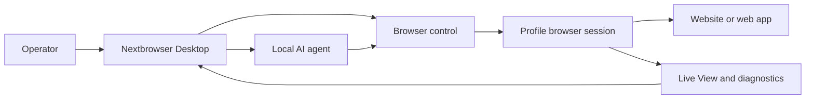

<!-- i18n-source-sha256: 7d99b995b47d93fc8a39fab53df59eab6cc4102b4b900d0d581d9ff8175bb1b5 -->

  

<h1 align="center">Nextbrowser</h1>

  <strong>macOS와 Windows에서 관리형 브라우저 세션으로 로컬 AI 에이전트를 실행하는 Electron, React, TypeScript 기반 데스크톱 콘솔입니다.</strong>

  <a href="https://nextbrowser.com/">웹사이트</a> ·
  <a href="https://docs.nextbrowser.com/">제품 문서</a> ·
  <a href="https://nextbrowser.com/use-cases">사용 사례</a> ·
  <a href="https://github.com/nextbrowser-oss/nextbrowser-app/releases/latest">다운로드</a> ·
  <a href="https://github.com/nextbrowser-oss/nextbrowser-app/discussions">Discussions</a>

  
  
  

  <a href="../../../README.md">English</a> ·
  <a href="../es/README.md">Español</a> ·
  <a href="../pt-BR/README.md">Português (Brasil)</a> ·
  <a href="../zh-CN/README.md">简体中文</a> ·
  <a href="../ja/README.md">日本語</a> ·
  <strong>한국어</strong> ·
  <a href="../de/README.md">Deutsch</a> ·
  <a href="../fr/README.md">Français</a> ·
  <a href="../ru/README.md">Русский</a> ·
  <a href="../uk/README.md">Українська</a> ·
  <a href="../ar/README.md">العربية</a> ·
  <a href="../hi/README.md">हिन्दी</a> ·
  <a href="../tr/README.md">Türkçe</a> ·
  <a href="../id/README.md">Bahasa Indonesia</a> ·
  <a href="../vi/README.md">Tiếng Việt</a> ·
  <a href="../th/README.md">ไทย</a> ·
  <a href="../it/README.md">Italiano</a> ·
  <a href="../pl/README.md">Polski</a> ·
  <a href="../nl/README.md">Nederlands</a> ·
  <a href="../fa/README.md">فارسی</a>

  

## Nextbrowser를 사용하는 이유

AI 에이전트의 브라우저 작업은 하나의 프롬프트로 끝나지 않습니다. 운영자는 브라우저 ID를 선택하고, 세션을 제어하며, 에이전트 프로세스를 관찰하고, 페이지나 실행 실패에서 복구해야 합니다. Nextbrowser는 이러한 제어 기능을 하나의 데스크톱 화면에 모읍니다.

- profile, session, proxy/fingerprint rotation, 에이전트 작업을 하나의 운영 화면에서 관리합니다.
- 실행을 시작한 뒤 방치하지 않고 스트리밍되는 에이전트 출력과 브라우저 활동을 확인합니다.
- skill, custom script, preflight check, schedule을 통해 워크플로를 재사용합니다.
- 페이지에 challenge가 나타나면 브라우저 상태를 진단하고 captcha 도구를 호출합니다. 해결 성공은 보장되지 않습니다.

## 주요 기능

| 영역 | 제공 기능 |
| --- | --- |
| Profile 및 session | profile, session 수명 주기, proxy/fingerprint rotation을 관리합니다. |
| 에이전트 작업 공간 | chat history, queue, 중지/편집 제어, conversation fork와 함께 로컬 에이전트를 실행합니다. |
| 재사용 가능한 워크플로 | browser-session preflight를 거쳐 skill과 custom script를 적용합니다. |
| 예약 작업 | 반복되는 에이전트 실행을 구성하고 데스크톱 콘솔에서 검토합니다. |
| 가시성 | Live View, 실행 상태, 진단 정보를 사용해 브라우저 작업을 확인합니다. |
| CAPTCHA 도구 | 챌린지를 감지하고 지원되는 처리 흐름을 실행하지만 우회를 보장하지 않습니다. |

개념, 화면, 워크플로 및 운영 지침은 [제품 가이드](../../product-guide.md)를 참조하세요.

## 빠른 시작

1. [최신 Nextbrowser 릴리스](https://github.com/nextbrowser-oss/nextbrowser-app/releases/latest)에서 제공되는 macOS 또는 Windows 빌드를 다운로드합니다.
2. [제품 문서](https://docs.nextbrowser.com/)에 따라 브라우저 환경과 API key를 구성합니다.
3. Nextbrowser를 열고 profile을 선택한 다음 session을 시작하고, 설치된 로컬 에이전트를 선택해 작업을 제출합니다.
4. 작업이 실행되는 동안 Chat과 Live View를 열어 두고 필요에 따라 작업을 중지, 편집, queue 또는 fork합니다.

브라우저 제어와 진단은 [브라우저 제어 참고 문서](../../cli-reference.md)를, 애플리케이션과 브라우저 설정은 [구성](../../configuration.md)을 참고하세요.

## 데모 및 사용 사례

게시된 시나리오는 [Nextbrowser 사용 사례 페이지](https://nextbrowser.com/use-cases)에서 확인할 수 있습니다. 위 미리보기는 NextBrowser 인터페이스가 작동하는 모습을 보여 줍니다.

일반적인 워크플로:

- profile session을 시작하고 로컬 에이전트에 브라우저 작업을 준 뒤 진행 상황을 관찰합니다.
- session preflight 후 skill 또는 비공개 custom script를 적용합니다.
- 워크플로의 릴리스 날짜를 약속하지 않은 상태로 반복 작업을 schedule합니다.
- 실행이 실패하면 session, tab, page 및 identity 상태를 확인합니다.
- captcha를 감지하고 사용 가능한 처리 경로를 선택하며, 필요한 경우 사람이 개입합니다.

## 작동 방식

Nextbrowser는 데스크톱 제어 화면입니다. 프로필은 브라우저 ID를 정의하고, 세션은 실행 중인 브라우저 컨텍스트를 제공하며, 브라우저 활동은 Live View와 진단 정보로 확인할 수 있습니다. 전체 모델은 [제품 가이드](../../product-guide.md)를 참고하세요.

## 문서

- [제품 가이드](../../product-guide.md) — 개념, 화면, 워크플로 및 안전.
- [브라우저 제어 참고 문서](../../cli-reference.md) — Nextbrowser에서 사용하는 브라우저 작업과 진단.
- [구성 및 개발](../../../docs/configuration.md) — 애플리케이션 설정, 로컬 상태, 분석 참고 사항 및 개발 스크립트.
- [문제 해결](../../troubleshooting.md) — account부터 page까지의 diagnostics 및 일반적인 복구 경로.
- [언어 색인](../README.md) — README의 20개 언어 버전.

## 로드맵

로드맵 작업은 [GitHub Issues](https://github.com/nextbrowser-oss/nextbrowser-app/issues)와 프로젝트 보드에서 추적합니다. Issue나 프로젝트 카드는 제안일 뿐 릴리스 약속이나 일정을 의미하지 않습니다.

## 기여

변경 사항을 열기 전에 [CONTRIBUTING.md](../../../CONTRIBUTING.md)를 읽어 주세요. 재현 가능한 bug, 범위가 명확한 feature proposal, demo request 및 문서 수정에는 구조화된 issue form을 사용하세요. README를 변경할 때는 19개 번역 전체와 i18n manifest를 함께 동기화해야 합니다.

## 커뮤니티 및 지원

- [Nextbrowser Discord](https://discord.gg/jfYjwJQdQ)에 참여해 커뮤니티 대화, 설정 도움말, 제품 업데이트를 확인하세요.
- 일반적인 질문과 아이디어 공유에는 [GitHub Discussions](https://github.com/nextbrowser-oss/nextbrowser-app/discussions)를 이용하세요.
- 실행 가능하고 범위가 명확한 작업에는 [GitHub Issues](https://github.com/nextbrowser-oss/nextbrowser-app/issues)를 사용하세요.
- 취약점은 [SECURITY.md](../../../SECURITY.md)에 따라 비공개로 신고하고, issue에 보안 세부 정보를 게시하지 마세요.
- runtime 또는 browser-session 문제는 먼저 [문제 해결](../../troubleshooting.md)을 확인하세요.

## 라이선스

**MIT** 라이선스로 배포됩니다. 전문: [MIT License](../../../LICENSE).
