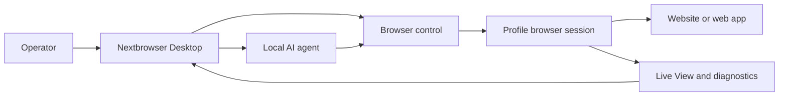

<!-- i18n-source-sha256: af4bcd2f6a6e0d0d097d0d490899d87da19f18d99ab163ce82c094c760efea99 -->

  

<h1 align="center">Nextbrowser</h1>

  <strong>Een desktopconsole gebouwd met Electron, React en TypeScript voor het uitvoeren van lokale AI-agents in beheerde browsersessies op macOS en Windows.</strong>

  <a href="https://nextbrowser.com/">Website</a> ·
  <a href="https://docs.nextbrowser.com/">Productdocumentatie</a> ·
  <a href="https://nextbrowser.com/use-cases">Gebruiksscenario’s</a> ·
  <a href="https://github.com/nextbrowser-oss/nextbrowser-app/releases/latest">Downloaden</a> ·
  <a href="https://github.com/nextbrowser-oss/nextbrowser-app/discussions">Discussions</a>

  
  
  

  <a href="../../../README.md">English</a> ·
  <a href="../es/README.md">Español</a> ·
  <a href="../pt-BR/README.md">Português (Brasil)</a> ·
  <a href="../zh-CN/README.md">简体中文</a> ·
  <a href="../ja/README.md">日本語</a> ·
  <a href="../ko/README.md">한국어</a> ·
  <a href="../de/README.md">Deutsch</a> ·
  <a href="../fr/README.md">Français</a> ·
  <a href="../ru/README.md">Русский</a> ·
  <a href="../uk/README.md">Українська</a> ·
  <a href="../ar/README.md">العربية</a> ·
  <a href="../hi/README.md">हिन्दी</a> ·
  <a href="../tr/README.md">Türkçe</a> ·
  <a href="../id/README.md">Bahasa Indonesia</a> ·
  <a href="../vi/README.md">Tiếng Việt</a> ·
  <a href="../th/README.md">ไทย</a> ·
  <a href="../it/README.md">Italiano</a> ·
  <a href="../pl/README.md">Polski</a> ·
  <strong>Nederlands</strong> ·
  <a href="../fa/README.md">فارسی</a>

  

## Waarom Nextbrowser

Browserwerk door een AI-agent omvat meer dan één prompt: een operator moet een browseridentiteit kiezen, de sessie besturen, het agentproces observeren en herstellen wanneer een pagina of uitvoering mislukt. Nextbrowser brengt deze bediening samen in één desktopinterface.

- Houd profielen, sessies, proxy-/fingerprintrotatie en agentwerk bij elkaar in één operationele weergave.
- Bekijk gestreamde agentuitvoer en browseractiviteit in plaats van runs na het starten aan hun lot over te laten.
- Hergebruik workflows via skills, custom scripts, preflight-controles en planningen.
- Diagnoseer de browserstatus en roep captcha-tools aan wanneer een pagina een uitdaging toont; succesvol oplossen is nooit gegarandeerd.

## Belangrijkste functies

| Gebied | Wat beschikbaar is |
| --- | --- |
| Profielen en sessies | Beheer profielen, de levenscyclus van sessies en proxy-/fingerprintrotatie. |
| Agentwerkruimte | Voer lokale agents uit met Chatgeschiedenis, wachtrijen, stop-/bewerkingsfuncties en conversation forks. |
| Herbruikbare workflows | Pas skills en custom scripts toe met een preflight van de browsersessie. |
| Gepland werk | Configureer terugkerende agentruns en bekijk ze vanuit de desktopconsole. |
| Zichtbaarheid | Gebruik Live View, uitvoeringsstatus en diagnostiek om browserwerk te controleren. |
| Captcha-hulpmiddelen | Detecteer uitdagingen en start ondersteunde afhandelingsroutes zonder garantie op omzeiling. |

Lees de [producthandleiding](../../product-guide.md) voor concepten, schermen, workflows en bedieningsrichtlijnen.

## Snel aan de slag

1. Download een beschikbare build voor macOS of Windows uit de [nieuwste Nextbrowser-release](https://github.com/nextbrowser-oss/nextbrowser-app/releases/latest).
2. Volg de [productdocumentatie](https://docs.nextbrowser.com/) om de browseromgeving en je API key te configureren.
3. Open Nextbrowser, selecteer een profiel, start de sessie, kies een geïnstalleerde lokale agent en dien een taak in.
4. Houd Chat en Live View geopend terwijl de taak wordt uitgevoerd; stop, bewerk, plaats werk in de wachtrij of maak een fork wanneer dat nodig is.

Raadpleeg de [browserbesturingsreferentie](../../cli-reference.md) voor bediening en diagnostiek. Zie [configuratie](../../configuration.md) voor instellingen van de toepassing en browser.

## Demo’s en gebruiksscenario’s

Bekijk gepubliceerde scenario’s op de [Nextbrowser-pagina met gebruikssituaties](https://nextbrowser.com/use-cases). De preview hierboven toont de NextBrowser-interface in actie.

Veelvoorkomende workflows zijn:

- een profielsessie starten, een lokale agent een browsertaak geven en de voortgang bekijken;
- na de preflight van de sessie een skill of privé-custom script toepassen;
- een terugkerende taak plannen zonder aan de workflow een beloofde releasedatum te koppelen;
- de status van sessie, tabbladen, pagina en identiteit inspecteren wanneer een run mislukt;
- een captcha detecteren en een beschikbare afhandelingsroute kiezen, met menselijke tussenkomst wanneer dat nodig is.

## Hoe het werkt

Nextbrowser is het desktopbedieningsvlak. Profielen definiëren browseridentiteiten, sessies bieden de actieve browsercontext en activiteit blijft zichtbaar via Live View en diagnostiek. Lees de [productgids](../../product-guide.md) voor het volledige model.

## Documentatie

- [Producthandleiding](../../product-guide.md) — concepten, schermen, workflows en veiligheid.
- [Browserbesturingsreferentie](../../cli-reference.md) — browserhandelingen en diagnostiek voor Nextbrowser.
- [Configuratie en ontwikkeling](../../../docs/configuration.md) — applicatie-instellingen, lokale status, analytics-notities en ontwikkelscripts.
- [Probleemoplossing](../../troubleshooting.md) — diagnostiek van account tot pagina en veelgebruikte herstelroutes.
- [Talenindex](../README.md) — alle 20 README-edities.

## Roadmap

Roadmapwerk wordt gevolgd via [GitHub Issues](https://github.com/nextbrowser-oss/nextbrowser-app/issues) en projectborden. Een issue of projectkaart is een voorstel, geen releasebelofte; er worden geen datums geïmpliceerd.

## Bijdragen

Lees [CONTRIBUTING.md](../../../CONTRIBUTING.md) voordat je een wijziging indient. Gebruik de gestructureerde Issue Forms voor reproduceerbare bugs, afgebakende functievoorstellen, demoverzoeken en documentatiecorrecties. Bij README-wijzigingen moeten alle 19 vertalingen en het i18n-manifest gesynchroniseerd blijven.

## Community en ondersteuning

- Stel algemene vragen en deel ideeën in [GitHub Discussions](https://github.com/nextbrowser-oss/nextbrowser-app/discussions).
- Gebruik [GitHub Issues](https://github.com/nextbrowser-oss/nextbrowser-app/issues) voor uitvoerbaar, afgebakend werk.
- Volg [SECURITY.md](../../../SECURITY.md) om kwetsbaarheden privé te melden; publiceer geen beveiligingsdetails in een issue.
- Begin bij [probleemoplossing](../../troubleshooting.md) voor problemen met de runtime en browsersessies.

## Licentie

Gedistribueerd onder de **MIT**-licentie. Volledige tekst: [opensource.org/licenses/MIT](https://opensource.org/licenses/MIT).
