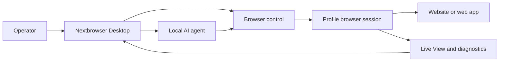

<!-- i18n-source-sha256: af4bcd2f6a6e0d0d097d0d490899d87da19f18d99ab163ce82c094c760efea99 -->

  

<h1 align="center">Nextbrowser</h1>

  <strong>Konsola desktopowa oparta na Electron, React i TypeScript do uruchamiania lokalnych agentów AI w zarządzanych sesjach przeglądarki na macOS i Windows.</strong>

  <a href="https://nextbrowser.com/">Strona internetowa</a> ·
  <a href="https://docs.nextbrowser.com/">Dokumentacja produktu</a> ·
  <a href="https://nextbrowser.com/use-cases">Przypadki użycia</a> ·
  <a href="https://github.com/nextbrowser-oss/nextbrowser-app/releases/latest">Pobierz</a> ·
  <a href="https://github.com/nextbrowser-oss/nextbrowser-app/discussions">Discussions</a>

  
  
  

  <a href="../../../README.md">English</a> ·
  <a href="../es/README.md">Español</a> ·
  <a href="../pt-BR/README.md">Português (Brasil)</a> ·
  <a href="../zh-CN/README.md">简体中文</a> ·
  <a href="../ja/README.md">日本語</a> ·
  <a href="../ko/README.md">한국어</a> ·
  <a href="../de/README.md">Deutsch</a> ·
  <a href="../fr/README.md">Français</a> ·
  <a href="../ru/README.md">Русский</a> ·
  <a href="../uk/README.md">Українська</a> ·
  <a href="../ar/README.md">العربية</a> ·
  <a href="../hi/README.md">हिन्दी</a> ·
  <a href="../tr/README.md">Türkçe</a> ·
  <a href="../id/README.md">Bahasa Indonesia</a> ·
  <a href="../vi/README.md">Tiếng Việt</a> ·
  <a href="../th/README.md">ไทย</a> ·
  <a href="../it/README.md">Italiano</a> ·
  <strong>Polski</strong> ·
  <a href="../nl/README.md">Nederlands</a> ·
  <a href="../fa/README.md">فارسی</a>

  

## Dlaczego Nextbrowser

Praca agenta AI w przeglądarce obejmuje więcej niż jeden prompt: operator musi wybrać tożsamość przeglądarki, kontrolować sesję, obserwować proces agenta i odzyskiwać działanie po błędzie strony lub uruchomienia. Nextbrowser łączy te elementy sterowania w jednym interfejsie desktopowym.

- Przechowuj profile, sesje, rotację proxy/fingerprint oraz pracę agentów w jednym widoku operacyjnym.
- Sprawdzaj strumieniowane dane wyjściowe agenta i aktywność przeglądarki, zamiast traktować uruchomienia jako zadania, o których zapomina się po ich rozpoczęciu.
- Ponownie wykorzystuj workflow dzięki skills, custom scripts, kontrolom preflight i harmonogramom.
- Diagnozuj stan przeglądarki i wywołuj narzędzia captcha, gdy strona przedstawia wyzwanie; skuteczne rozwiązanie nigdy nie jest gwarantowane.

## Najważniejsze funkcje

| Obszar | Dostępne możliwości |
| --- | --- |
| Profile i sesje | Zarządzaj profilami, cyklem życia sesji oraz rotacją proxy/fingerprint. |
| Przestrzeń robocza agenta | Uruchamiaj lokalnych agentów z historią Chat, kolejkami, kontrolami zatrzymywania/edycji i forkami konwersacji. |
| Workflow wielokrotnego użytku | Stosuj skills i custom scripts z preflight sesji przeglądarki. |
| Praca zaplanowana | Konfiguruj cykliczne uruchomienia agentów i przeglądaj je w konsoli desktopowej. |
| Widoczność | Używaj Live View, statusu uruchomienia i diagnostyki do sprawdzania pracy przeglądarki. |
| Narzędzia captcha | Wykrywaj wyzwania i uruchamiaj obsługiwane ścieżki postępowania bez gwarancji obejścia. |

Zapoznaj się z [przewodnikiem po produkcie](../../product-guide.md), aby poznać pojęcia, ekrany, workflow i wskazówki operacyjne.

## Szybki start

1. Pobierz dostępny build dla macOS lub Windows z [najnowszego wydania Nextbrowser](https://github.com/nextbrowser-oss/nextbrowser-app/releases/latest).
2. Postępuj zgodnie z [dokumentacją produktu](https://docs.nextbrowser.com/), aby skonfigurować środowisko przeglądarki i API key.
3. Otwórz Nextbrowser, wybierz profil, uruchom jego sesję, wybierz zainstalowanego lokalnego agenta i prześlij zadanie.
4. Pozostaw Chat i Live View otwarte podczas wykonywania zadania; w razie potrzeby zatrzymaj, edytuj, umieść pracę w kolejce lub utwórz jej fork.

Informacje o sterowaniu przeglądarką i diagnostyce znajdziesz w [odpowiednim przewodniku](../../cli-reference.md). Ustawienia aplikacji i przeglądarki opisano w [konfiguracji](../../configuration.md).

## Dema i przypadki użycia

Opublikowane scenariusze znajdziesz na [stronie przypadków użycia Nextbrowser](https://nextbrowser.com/use-cases). Podgląd powyżej pokazuje interfejs NextBrowser w działaniu.

Typowe przepływy pracy obejmują:

- uruchomienie sesji profilu, przekazanie lokalnemu agentowi zadania w przeglądarce i obserwowanie postępu;
- zastosowanie skill lub prywatnego custom script po preflight sesji;
- zaplanowanie zadania cyklicznego bez przypisywania workflow obietnicy daty wydania;
- sprawdzenie stanu sesji, kart, strony i tożsamości, gdy uruchomienie się nie powiedzie;
- wykrycie captcha i wybranie dostępnej ścieżki obsługi, z udziałem człowieka, gdy jest potrzebny.

## Jak to działa

Nextbrowser jest desktopowym panelem sterowania. Profile definiują tożsamości przeglądarki, sesje zapewniają aktywny kontekst, a aktywność pozostaje widoczna w Live View i diagnostyce. Pełny model opisano w [przewodniku po produkcie](../../product-guide.md).

## Dokumentacja

- [Przewodnik po produkcie](../../product-guide.md) — pojęcia, ekrany, workflow i bezpieczeństwo.
- [Przewodnik sterowania przeglądarką](../../cli-reference.md) — operacje i diagnostyka używane z Nextbrowser.
- [Konfiguracja i rozwój](../../../docs/configuration.md) — ustawienia aplikacji, stan lokalny, informacje o analityce i skrypty deweloperskie.
- [Rozwiązywanie problemów](../../troubleshooting.md) — diagnostyka od konta do strony oraz typowe ścieżki przywracania działania.
- [Indeks języków](../README.md) — wszystkie 20 wersji README.

## Roadmap

Prace nad roadmapą są śledzone przez [GitHub Issues](https://github.com/nextbrowser-oss/nextbrowser-app/issues) i tablice projektowe. Issue lub karta projektu jest propozycją, a nie zobowiązaniem wydania; nie oznacza żadnej daty.

## Współtworzenie

Przed zaproponowaniem zmiany przeczytaj [CONTRIBUTING.md](../../../CONTRIBUTING.md). Korzystaj ze strukturyzowanych Issue Forms do zgłaszania powtarzalnych błędów, precyzyjnych propozycji funkcji, próśb o dema i poprawek dokumentacji. Zmiany README muszą utrzymywać synchronizację wszystkich 19 tłumaczeń i manifestu i18n.

## Społeczność i pomoc

- Zadawaj pytania ogólne i udostępniaj pomysły w [GitHub Discussions](https://github.com/nextbrowser-oss/nextbrowser-app/discussions).
- Używaj [GitHub Issues](https://github.com/nextbrowser-oss/nextbrowser-app/issues) do zadań wykonalnych i precyzyjnie określonych.
- Postępuj zgodnie z [SECURITY.md](../../../SECURITY.md), aby prywatnie zgłaszać luki; nie publikuj szczegółów bezpieczeństwa w issue.
- W przypadku problemów z runtime i sesjami przeglądarki zacznij od [rozwiązywania problemów](../../troubleshooting.md).

## Licencja

Udostępniane na licencji **MIT**. Pełny tekst: [opensource.org/licenses/MIT](https://opensource.org/licenses/MIT).
