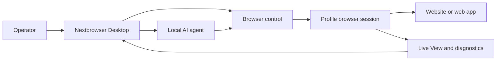

<!-- i18n-source-sha256: af4bcd2f6a6e0d0d097d0d490899d87da19f18d99ab163ce82c094c760efea99 -->

  

<h1 align="center">Nextbrowser</h1>

  <strong>Um console desktop em Electron, React e TypeScript para executar agentes de IA locais em sessões gerenciadas de navegador no macOS e Windows.</strong>

  <a href="https://nextbrowser.com/">Site</a> ·
  <a href="https://docs.nextbrowser.com/">Documentação do produto</a> ·
  <a href="https://nextbrowser.com/use-cases">Casos de uso</a> ·
  <a href="https://github.com/nextbrowser-oss/nextbrowser-app/releases/latest">Download</a> ·
  <a href="https://github.com/nextbrowser-oss/nextbrowser-app/discussions">Discussions</a>

  
  
  

  <a href="../../../README.md">English</a> ·
  <a href="../es/README.md">Español</a> ·
  <strong>Português (Brasil)</strong> ·
  <a href="../zh-CN/README.md">简体中文</a> ·
  <a href="../ja/README.md">日本語</a> ·
  <a href="../ko/README.md">한국어</a> ·
  <a href="../de/README.md">Deutsch</a> ·
  <a href="../fr/README.md">Français</a> ·
  <a href="../ru/README.md">Русский</a> ·
  <a href="../uk/README.md">Українська</a> ·
  <a href="../ar/README.md">العربية</a> ·
  <a href="../hi/README.md">हिन्दी</a> ·
  <a href="../tr/README.md">Türkçe</a> ·
  <a href="../id/README.md">Bahasa Indonesia</a> ·
  <a href="../vi/README.md">Tiếng Việt</a> ·
  <a href="../th/README.md">ไทย</a> ·
  <a href="../it/README.md">Italiano</a> ·
  <a href="../pl/README.md">Polski</a> ·
  <a href="../nl/README.md">Nederlands</a> ·
  <a href="../fa/README.md">فارسی</a>

  

## Por que usar o Nextbrowser

O trabalho de um agente de IA no navegador envolve mais do que um prompt: o operador precisa escolher uma identidade de navegador, controlar a sessão, observar o processo do agente e se recuperar quando uma página ou execução falha. O Nextbrowser reúne esses controles em uma única interface desktop.

- Mantenha perfis, sessões, rotação de proxy/fingerprint e trabalho dos agentes em uma única visão operacional.
- Inspecione a saída transmitida do agente e a atividade do navegador em vez de tratar as execuções como tarefas que são iniciadas e esquecidas.
- Reutilize fluxos de trabalho por meio de skills, custom scripts, verificações preflight e agendamentos.
- Diagnostique o estado do navegador e invoque ferramentas de captcha quando uma página apresentar um desafio; o sucesso da resolução nunca é garantido.

## Principais recursos

| Área | O que está disponível |
| --- | --- |
| Perfis e sessões | Gerencie perfis, o ciclo de vida das sessões e a rotação de proxy/fingerprint. |
| Espaço de trabalho do agente | Execute agentes locais com histórico de Chat, filas, controles de parada/edição e forks de conversas. |
| Fluxos de trabalho reutilizáveis | Aplique skills e custom scripts com preflight da sessão do navegador. |
| Trabalho agendado | Configure execuções recorrentes de agentes e revise-as no console desktop. |
| Visibilidade | Use o Live View, o status da execução e os diagnósticos para inspecionar o trabalho no navegador. |
| Ferramentas de captcha | Detecte desafios e acione fluxos de tratamento compatíveis sem garantia de bypass. |

Consulte o [guia do produto](../../product-guide.md) para ver conceitos, telas, fluxos de trabalho e orientações operacionais.

## Início rápido

1. Baixe um build disponível para macOS ou Windows na [versão mais recente do Nextbrowser](https://github.com/nextbrowser-oss/nextbrowser-app/releases/latest).
2. Siga a [documentação do produto](https://docs.nextbrowser.com/) para configurar o ambiente do navegador e sua API key.
3. Abra o Nextbrowser, selecione um perfil, inicie a sessão, escolha um agente local instalado e envie uma tarefa.
4. Mantenha Chat e Live View abertos durante a execução da tarefa; pare, edite, coloque na fila ou crie um fork do trabalho quando necessário.

Para controles do navegador e diagnósticos, consulte a [referência correspondente](../../cli-reference.md). Para configurar o aplicativo e o navegador, consulte [configuração](../../configuration.md).

## Demos e casos de uso

Explore cenários publicados na [página de casos de uso do Nextbrowser](https://nextbrowser.com/use-cases). A prévia acima mostra a interface do NextBrowser em funcionamento.

Fluxos de trabalho comuns incluem:

- iniciar uma sessão de perfil, atribuir uma tarefa de navegador a um agente local e observar o progresso;
- aplicar uma skill ou um custom script privado após o preflight da sessão;
- agendar uma tarefa recorrente sem associar uma promessa de data de lançamento ao fluxo de trabalho;
- inspecionar o estado da sessão, das abas, da página e da identidade quando uma execução falha;
- detectar um captcha e escolher um caminho de tratamento disponível, com intervenção humana quando necessária.

## Como funciona

O Nextbrowser é a superfície de controle desktop. Os perfis definem identidades do navegador, as sessões fornecem o contexto ativo e a atividade permanece visível no Live View e nos diagnósticos. Leia o [guia do produto](../../product-guide.md) para entender o modelo completo.

## Documentação

- [Guia do produto](../../product-guide.md) — conceitos, telas, fluxos de trabalho e segurança.
- [Referência de controle do navegador](../../cli-reference.md) — operações e diagnósticos usados com o Nextbrowser.
- [Configuração e desenvolvimento](../../../docs/configuration.md) — configurações do aplicativo, estado local, notas de analytics e scripts de desenvolvimento.
- [Solução de problemas](../../troubleshooting.md) — diagnósticos da conta até a página e caminhos comuns de recuperação.
- [Índice de idiomas](../README.md) — todas as 20 edições do README.

## Roadmap

O trabalho do roadmap é acompanhado por [GitHub Issues](https://github.com/nextbrowser-oss/nextbrowser-app/issues) e quadros de projeto. Uma issue ou cartão de projeto é uma proposta, não um compromisso de lançamento; nenhuma data é implícita.

## Como contribuir

Leia [CONTRIBUTING.md](../../../CONTRIBUTING.md) antes de abrir uma alteração. Use os formulários estruturados de issues para bugs reproduzíveis, propostas de recursos com escopo definido, solicitações de demos e correções na documentação. Alterações no README devem manter as 19 traduções e o manifesto i18n sincronizados.

## Comunidade e suporte

- Faça perguntas gerais e compartilhe ideias no [GitHub Discussions](https://github.com/nextbrowser-oss/nextbrowser-app/discussions).
- Use [GitHub Issues](https://github.com/nextbrowser-oss/nextbrowser-app/issues) para trabalho acionável e com escopo definido.
- Siga o [SECURITY.md](../../../SECURITY.md) para relatar vulnerabilidades de forma privada; não publique detalhes de segurança em um issue.
- Comece pela [solução de problemas](../../troubleshooting.md) para problemas de runtime e de sessões do navegador.

## Licença

Distribuído sob a licença **MIT**. Texto completo: [opensource.org/licenses/MIT](https://opensource.org/licenses/MIT).
