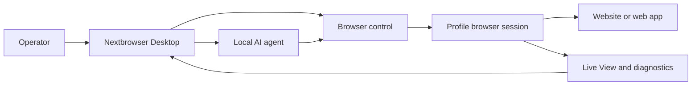

<!-- i18n-source-sha256: 7d99b995b47d93fc8a39fab53df59eab6cc4102b4b900d0d581d9ff8175bb1b5 -->

  

<h1 align="center">Nextbrowser</h1>

  <strong>Десктопная консоль на Electron, React и TypeScript для запуска локальных AI-агентов в управляемых браузерных сессиях на macOS и Windows.</strong>

  <a href="https://nextbrowser.com/">Сайт</a> ·
  <a href="https://docs.nextbrowser.com/">Документация продукта</a> ·
  <a href="https://nextbrowser.com/use-cases">Сценарии использования</a> ·
  <a href="https://github.com/nextbrowser-oss/nextbrowser-app/releases/latest">Скачать</a> ·
  <a href="https://github.com/nextbrowser-oss/nextbrowser-app/discussions">Обсуждения</a>

  
  
  

  <a href="../../../README.md">English</a> ·
  <a href="../es/README.md">Español</a> ·
  <a href="../pt-BR/README.md">Português (Brasil)</a> ·
  <a href="../zh-CN/README.md">简体中文</a> ·
  <a href="../ja/README.md">日本語</a> ·
  <a href="../ko/README.md">한국어</a> ·
  <a href="../de/README.md">Deutsch</a> ·
  <a href="../fr/README.md">Français</a> ·
  <strong>Русский</strong> ·
  <a href="../uk/README.md">Українська</a> ·
  <a href="../ar/README.md">العربية</a> ·
  <a href="../hi/README.md">हिन्दी</a> ·
  <a href="../tr/README.md">Türkçe</a> ·
  <a href="../id/README.md">Bahasa Indonesia</a> ·
  <a href="../vi/README.md">Tiếng Việt</a> ·
  <a href="../th/README.md">ไทย</a> ·
  <a href="../it/README.md">Italiano</a> ·
  <a href="../pl/README.md">Polski</a> ·
  <a href="../nl/README.md">Nederlands</a> ·
  <a href="../fa/README.md">فارسی</a>

  

## Почему Nextbrowser

Работа браузера с AI-агентом — это не просто выполнение запроса: оператор должен выбрать браузер, контролировать сеанс, следить за процессом работы агента и восстанавливать его в случае сбоя страницы или выполнения. Nextbrowser объединяет все эти элементы управления на одной рабочей поверхности.

- Держите профили, сессии, ротацию proxy/fingerprint и работу агентов в одном операционном представлении.
- Наблюдайте потоковый вывод агента и активность браузера, а не относитесь к запускам как к процессам без обратной связи.
- Повторно используйте рабочие процессы с помощью skills, пользовательских скриптов, предварительных проверок и расписаний.
- Диагностируйте состояние браузера и вызывайте инструменты captcha, когда страница показывает проверку; успешное решение никогда не гарантируется.

## Ключевые возможности

| Область | Что доступно |
| --- | --- |
| Профили и сессии | Управление профилями, жизненным циклом сессий и ротацией proxy/fingerprint. |
| Рабочее пространство агента | Запуск локальных агентов с историей Chat, очередями, элементами управления остановкой и редактированием, а также ответвлениями бесед. |
| Повторно используемые процессы | Применение skills и пользовательских скриптов с предварительной проверкой браузерной сессии. |
| Работа по расписанию | Настройка повторяющихся запусков агентов и их просмотр в десктопной консоли. |
| Наблюдаемость | Используйте Live View, статус выполнения и диагностику для контроля работы браузера. |
| Инструменты captcha | Обнаруживайте проверки и запускайте поддерживаемые сценарии обработки без гарантии обхода. |

Концепции, экраны, рабочие процессы и рекомендации по эксплуатации описаны в [руководстве по продукту](../../product-guide.md).

## Быстрый старт

1. Загрузите доступную сборку для macOS или Windows из [последнего релиза Nextbrowser](https://github.com/nextbrowser-oss/nextbrowser-app/releases/latest).
2. Следуйте [документации продукта](https://docs.nextbrowser.com/), чтобы настроить браузерное окружение и API-ключ.
3. Откройте Nextbrowser, выберите профиль, запустите его сессию, выберите установленного локального агента и отправьте задачу.
4. Держите Chat и Live View открытыми во время выполнения задачи; при необходимости останавливайте, редактируйте, ставьте работу в очередь или создавайте ответвление.

Описание управления браузером и диагностики см. в [справочнике](../../cli-reference.md). Настройки приложения и браузера приведены в разделе [конфигурации](../../configuration.md).

## Демонстрации и сценарии использования

Опубликованные сценарии собраны на [странице примеров использования Nextbrowser](https://nextbrowser.com/use-cases). Превью выше показывает интерфейс NextBrowser в работе.

Распространённые рабочие процессы:

- запустить сессию профиля, дать локальному агенту задачу в браузере и наблюдать за ходом выполнения;
- применить skill или приватный пользовательский скрипт после предварительной проверки сессии;
- запланировать повторяющуюся задачу, не связывая рабочий процесс с обещанием даты релиза;
- проверить состояние сессии, вкладки, страницы и идентичности после сбоя запуска;
- обнаружить captcha и выбрать доступный способ обработки с участием человека, когда оно требуется.

## Как это работает

Nextbrowser — это рабочая поверхность для управления. Профили определяют браузерные идентичности, сеансы предоставляют активный контекст браузера, а работа остается наблюдаемой через Live View и диагностику. Полная модель описана в [руководстве по продукту](../../product-guide.md).

## Документация

- [Руководство по продукту](../../product-guide.md) — концепции, экраны, рабочие процессы и безопасность.
- [Справочник по управлению браузером](../../cli-reference.md) — основные операции и диагностика Nextbrowser.
- [Конфигурация и разработка](../../../docs/configuration.md) — настройки приложения, локальное состояние, аналитика и скрипты разработки.
- [Устранение неполадок](../../troubleshooting.md) — диагностика от уровня аккаунта до страницы и типичные способы восстановления.
- [Индекс языков](../README.md) — все 20 версий README.

## Дорожная карта

Работа по дорожной карте отслеживается через [GitHub Issues](https://github.com/nextbrowser-oss/nextbrowser-app/issues) и доски проектов. Issue или карточка проекта является предложением, а не обязательством по выпуску; даты не подразумеваются.

## Участие в разработке

Перед внесением изменений прочитайте [CONTRIBUTING.md](../../../CONTRIBUTING.md). Используйте структурированные формы issues для воспроизводимых ошибок, сфокусированных предложений функций, запросов демонстраций и исправлений документации. Изменения README должны синхронно обновлять все 19 переводов и i18n manifest.

## Сообщество и поддержка

- Присоединяйтесь к [Discord Nextbrowser](https://discord.gg/jfYjwJQdQ) для общения с сообществом, помощи с настройкой и новостей продукта.
- Задавайте общие вопросы и делитесь идеями в [GitHub Discussions](https://github.com/nextbrowser-oss/nextbrowser-app/discussions).
- Используйте [GitHub Issues](https://github.com/nextbrowser-oss/nextbrowser-app/issues) для конкретной работы с чёткими границами.
- Следуйте [SECURITY.md](../../../SECURITY.md) для приватного сообщения об уязвимостях; не публикуйте сведения о безопасности в issue.
- При проблемах с runtime и браузерными сессиями начните с раздела [устранения неполадок](../../troubleshooting.md).

## Лицензия

Распространяется по лицензии **MIT**. Полный текст: [MIT License](../../../LICENSE).
