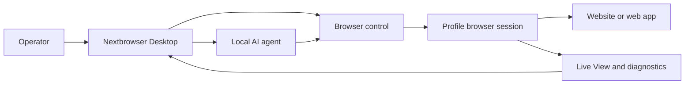

<!-- i18n-source-sha256: af4bcd2f6a6e0d0d097d0d490899d87da19f18d99ab163ce82c094c760efea99 -->

  

<h1 align="center">Nextbrowser</h1>

  <strong>คอนโซลเดสก์ท็อปที่สร้างด้วย Electron, React และ TypeScript สำหรับเรียกใช้ AI agent ภายในเซสชันเบราว์เซอร์ที่จัดการบน macOS และ Windows</strong>

  <a href="https://nextbrowser.com/">เว็บไซต์</a> ·
  <a href="https://docs.nextbrowser.com/">เอกสารผลิตภัณฑ์</a> ·
  <a href="https://nextbrowser.com/use-cases">กรณีใช้งาน</a> ·
  <a href="https://github.com/nextbrowser-oss/nextbrowser-app/releases/latest">ดาวน์โหลด</a> ·
  <a href="https://github.com/nextbrowser-oss/nextbrowser-app/discussions">การสนทนา</a>

  
  
  

  <a href="../../../README.md">English</a> ·
  <a href="../es/README.md">Español</a> ·
  <a href="../pt-BR/README.md">Português (Brasil)</a> ·
  <a href="../zh-CN/README.md">简体中文</a> ·
  <a href="../ja/README.md">日本語</a> ·
  <a href="../ko/README.md">한국어</a> ·
  <a href="../de/README.md">Deutsch</a> ·
  <a href="../fr/README.md">Français</a> ·
  <a href="../ru/README.md">Русский</a> ·
  <a href="../uk/README.md">Українська</a> ·
  <a href="../ar/README.md">العربية</a> ·
  <a href="../hi/README.md">हिन्दी</a> ·
  <a href="../tr/README.md">Türkçe</a> ·
  <a href="../id/README.md">Bahasa Indonesia</a> ·
  <a href="../vi/README.md">Tiếng Việt</a> ·
  <strong>ไทย</strong> ·
  <a href="../it/README.md">Italiano</a> ·
  <a href="../pl/README.md">Polski</a> ·
  <a href="../nl/README.md">Nederlands</a> ·
  <a href="../fa/README.md">فارسی</a>

  

## เหตุผลที่เลือก Nextbrowser

งานของ AI agent ในเบราว์เซอร์มีมากกว่าหนึ่ง prompt: ผู้ปฏิบัติงานต้องเลือกตัวตนของเบราว์เซอร์ ควบคุมเซสชัน ตรวจสอบกระบวนการของ agent และกู้คืนเมื่อหน้าเว็บหรือการทำงานล้มเหลว Nextbrowser รวมการควบคุมเหล่านี้ไว้ในอินเทอร์เฟซเดสก์ท็อปเดียว

- จัดการ profile, session, proxy/fingerprint rotation และงานของ agent ใน operational view เดียว
- ตรวจสอบ output ของ agent ที่ stream มาและกิจกรรมของเบราว์เซอร์ แทนที่จะเริ่ม run แล้วปล่อยทิ้งไว้
- ใช้ workflow ซ้ำผ่าน skill, custom script, preflight check และ schedule
- วินิจฉัยสถานะเบราว์เซอร์และเรียก captcha tool เมื่อ page แสดง challenge โดยไม่มีการรับประกันว่าจะไขได้สำเร็จ

## คุณสมบัติหลัก

| ส่วน | ความสามารถที่มี |
| --- | --- |
| Profile และ session | จัดการ profile, วงจรชีวิตของ session และ proxy/fingerprint rotation |
| Agent workspace | รัน local agent พร้อม chat history, queue, การควบคุมหยุด/แก้ไข และ conversation fork |
| Workflow ที่ใช้ซ้ำได้ | ใช้ skill และ custom script พร้อม browser-session preflight |
| งานตามกำหนดเวลา | กำหนดค่า agent run แบบเกิดซ้ำและตรวจสอบจาก desktop console |
| การมองเห็น | ใช้ Live View สถานะการทำงาน และข้อมูลวินิจฉัยเพื่อตรวจสอบงานของเบราว์เซอร์ |
| เครื่องมือ captcha | ตรวจจับความท้าทายและเรียกใช้กระบวนการจัดการที่รองรับโดยไม่รับประกันการข้าม |

ดูแนวคิด หน้าจอ workflow และแนวทางการใช้งานได้ใน [คู่มือผลิตภัณฑ์](../../product-guide.md)

## เริ่มต้นอย่างรวดเร็ว

1. ดาวน์โหลด build สำหรับ macOS หรือ Windows ที่มีจาก [Nextbrowser release ล่าสุด](https://github.com/nextbrowser-oss/nextbrowser-app/releases/latest)
2. ทำตาม[เอกสารผลิตภัณฑ์](https://docs.nextbrowser.com/)เพื่อกำหนดค่าสภาพแวดล้อมเบราว์เซอร์และ API key
3. เปิด Nextbrowser เลือก profile เริ่ม session ของ profile นั้น เลือก local agent ที่ติดตั้งแล้ว และส่ง task
4. เปิด Chat และ Live View ไว้ระหว่างที่ task ทำงาน และหยุด แก้ไข ใส่ queue หรือ fork งานเมื่อจำเป็น

สำหรับการควบคุมเบราว์เซอร์และการวินิจฉัย โปรดดู[ข้อมูลอ้างอิง](../../cli-reference.md) และดู[การกำหนดค่า](../../configuration.md)สำหรับการตั้งค่าแอปพลิเคชันและเบราว์เซอร์

## Demo และกรณีใช้งาน

สำรวจสถานการณ์ที่เผยแพร่แล้วใน [หน้ากรณีการใช้งาน Nextbrowser](https://nextbrowser.com/use-cases) ตัวอย่างด้านบนแสดงอินเทอร์เฟซ NextBrowser ขณะทำงาน

เวิร์กโฟลว์ทั่วไปประกอบด้วย:

- เริ่ม profile session มอบ browser task ให้ local agent และติดตามความคืบหน้า
- ใช้ skill หรือ custom script ส่วนตัวหลัง session preflight
- schedule task ที่เกิดซ้ำโดยไม่ผูกมัด workflow ไว้กับคำสัญญาเรื่องวัน release
- ตรวจสอบสถานะ session, tab, page และ identity เมื่อ run ล้มเหลว
- ตรวจจับ captcha และเลือกแนวทางจัดการที่มี โดยให้มนุษย์เข้ามาดำเนินการเมื่อจำเป็น

## วิธีการทำงาน

Nextbrowser คือพื้นผิวควบคุมบนเดสก์ท็อป โปรไฟล์กำหนดตัวตนของเบราว์เซอร์ เซสชันให้บริบทที่กำลังทำงาน และกิจกรรมยังคงมองเห็นได้ผ่าน Live View และการวินิจฉัย อ่าน[คู่มือผลิตภัณฑ์](../../product-guide.md)สำหรับโมเดลฉบับเต็ม

## เอกสาร

- [คู่มือผลิตภัณฑ์](../../product-guide.md) — แนวคิด หน้าจอ workflow และความปลอดภัย
- [ข้อมูลอ้างอิงการควบคุมเบราว์เซอร์](../../cli-reference.md) — การทำงานและการวินิจฉัยของเบราว์เซอร์ที่ใช้กับ Nextbrowser
- [การกำหนดค่าและการพัฒนา](../../../docs/configuration.md) — การตั้งค่าแอป สถานะภายในเครื่อง หมายเหตุด้านการวิเคราะห์ และสคริปต์การพัฒนา
- [การแก้ไขปัญหา](../../troubleshooting.md) — diagnostics ตั้งแต่ account ถึง page และแนวทางกู้คืนทั่วไป
- [ดัชนีภาษา](../README.md) — README ครบทั้ง 20 ภาษา

## Roadmap

งานตาม roadmap ติดตามผ่าน [GitHub Issues](https://github.com/nextbrowser-oss/nextbrowser-app/issues) และบอร์ดโครงการ Issue หรือการ์ดโครงการเป็นข้อเสนอ ไม่ใช่คำมั่นว่าจะเผยแพร่ และไม่ได้ระบุวันที่

## การมีส่วนร่วม

อ่าน [CONTRIBUTING.md](../../../CONTRIBUTING.md) ก่อนเปิด change ใช้ issue form ที่มีโครงสร้างสำหรับ bug ที่ทำซ้ำได้ feature proposal ที่มีขอบเขตชัดเจน demo request และการแก้ไขเอกสาร การเปลี่ยน README ต้องอัปเดต translation ทั้ง 19 ภาษาและ i18n manifest ให้ตรงกัน

## ชุมชนและการสนับสนุน

- ถามคำถามทั่วไปและแบ่งปันแนวคิดใน [GitHub Discussions](https://github.com/nextbrowser-oss/nextbrowser-app/discussions)
- ใช้ [GitHub Issues](https://github.com/nextbrowser-oss/nextbrowser-app/issues) สำหรับงานที่ดำเนินการได้และมีขอบเขตชัดเจน
- ปฏิบัติตาม [SECURITY.md](../../../SECURITY.md) เพื่อรายงานช่องโหว่เป็นการส่วนตัว อย่าเผยแพร่รายละเอียดด้าน security ใน issue
- เริ่มจาก [การแก้ไขปัญหา](../../troubleshooting.md) สำหรับปัญหา runtime และ browser-session

## License

เผยแพร่ภายใต้สัญญาอนุญาต **MIT** ข้อความฉบับเต็ม: [opensource.org/licenses/MIT](https://opensource.org/licenses/MIT)
