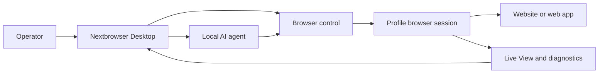

<!-- i18n-source-sha256: af4bcd2f6a6e0d0d097d0d490899d87da19f18d99ab163ce82c094c760efea99 -->

  

<h1 align="center">Nextbrowser</h1>

  <strong>macOS ve Windows üzerinde yönetilen tarayıcı oturumlarında yerel AI agent'ları çalıştırmak için Electron, React ve TypeScript ile geliştirilmiş bir masaüstü konsolu.</strong>

  <a href="https://nextbrowser.com/">Web sitesi</a> ·
  <a href="https://docs.nextbrowser.com/">Ürün dokümantasyonu</a> ·
  <a href="https://nextbrowser.com/use-cases">Kullanım senaryoları</a> ·
  <a href="https://github.com/nextbrowser-oss/nextbrowser-app/releases/latest">İndir</a> ·
  <a href="https://github.com/nextbrowser-oss/nextbrowser-app/discussions">Tartışmalar</a>

  
  
  

  <a href="../../../README.md">English</a> ·
  <a href="../es/README.md">Español</a> ·
  <a href="../pt-BR/README.md">Português (Brasil)</a> ·
  <a href="../zh-CN/README.md">简体中文</a> ·
  <a href="../ja/README.md">日本語</a> ·
  <a href="../ko/README.md">한국어</a> ·
  <a href="../de/README.md">Deutsch</a> ·
  <a href="../fr/README.md">Français</a> ·
  <a href="../ru/README.md">Русский</a> ·
  <a href="../uk/README.md">Українська</a> ·
  <a href="../ar/README.md">العربية</a> ·
  <a href="../hi/README.md">हिन्दी</a> ·
  <strong>Türkçe</strong> ·
  <a href="../id/README.md">Bahasa Indonesia</a> ·
  <a href="../vi/README.md">Tiếng Việt</a> ·
  <a href="../th/README.md">ไทย</a> ·
  <a href="../it/README.md">Italiano</a> ·
  <a href="../pl/README.md">Polski</a> ·
  <a href="../nl/README.md">Nederlands</a> ·
  <a href="../fa/README.md">فارسی</a>

  

## Neden Nextbrowser

Bir AI agent'ın tarayıcı çalışması tek bir prompt'tan fazlasını kapsar: operatör bir tarayıcı kimliği seçmeli, oturumu kontrol etmeli, agent sürecini gözlemlemeli ve sayfa ya da çalıştırma hatalarından kurtulmalıdır. Nextbrowser bu kontrolleri tek bir masaüstü arayüzünde birleştirir.

- Profilleri, oturumları, proxy/fingerprint rotasyonunu ve ajan çalışmalarını tek bir operasyonel görünümde tutun.
- Çalıştırmaları gözden uzak bırakmak yerine akış halinde gelen ajan çıktısını ve tarayıcı etkinliğini inceleyin.
- İş akışlarını skills, özel betikler, preflight kontrolleri ve zamanlamalar aracılığıyla yeniden kullanın.
- Bir sayfa doğrulama sunduğunda tarayıcı durumunu tanılayın ve captcha araçlarını çağırın; başarılı çözüm hiçbir zaman garanti edilmez.

## Temel özellikler

| Alan | Kullanılabilenler |
| --- | --- |
| Profiller ve oturumlar | Profilleri, oturum yaşam döngüsünü ve proxy/fingerprint rotasyonunu yönetin. |
| Ajan çalışma alanı | Yerel ajanları Chat geçmişi, kuyruklar, durdurma/düzenleme denetimleri ve konuşma dallarıyla çalıştırın. |
| Yeniden kullanılabilir iş akışları | Tarayıcı oturumu preflight kontrolüyle skills ve özel betikler uygulayın. |
| Zamanlanmış çalışma | Yinelenen ajan çalıştırmalarını yapılandırın ve masaüstü konsolundan inceleyin. |
| Görünürlük | Tarayıcı çalışmasını incelemek için Live View, çalıştırma durumu ve tanılamaları kullanın. |
| Captcha araçları | Zorlukları algılayın ve atlama garantisi olmadan desteklenen işleme akışlarını başlatın. |

Kavramlar, ekranlar, iş akışları ve kullanım rehberliği için [ürün kılavuzuna](../../product-guide.md) bakın.

## Hızlı Başlangıç

1. [En son Nextbrowser sürümünden](https://github.com/nextbrowser-oss/nextbrowser-app/releases/latest) kullanılabilir bir macOS veya Windows derlemesini indirin.
2. Tarayıcı ortamını ve API key'inizi yapılandırmak için [ürün belgelerini](https://docs.nextbrowser.com/) izleyin.
3. Nextbrowser’ı açın, bir profil seçin, oturumunu başlatın, kurulu bir yerel ajan seçin ve bir görev gönderin.
4. Görev çalışırken Chat ve Live View açık kalsın; gerektiğinde çalışmayı durdurun, düzenleyin, kuyruğa alın veya dallandırın.

Tarayıcı kontrolleri ve tanılama için [tarayıcı kontrol başvurusuna](../../cli-reference.md), uygulama ve tarayıcı yapılandırması için [yapılandırma](../../configuration.md) bölümüne bakın.

## Demolar ve kullanım senaryoları

Yayımlanmış senaryoları [Nextbrowser kullanım örnekleri sayfasında](https://nextbrowser.com/use-cases) inceleyin. Yukarıdaki önizleme NextBrowser arayüzünü çalışırken gösterir.

Yaygın iş akışları şunlardır:

- bir profil oturumu başlatmak, yerel bir ajana tarayıcı görevi vermek ve ilerlemeyi gözlemlemek;
- oturum preflight kontrolünden sonra bir skill veya özel, gizli betik uygulamak;
- iş akışına bir sürüm tarihi vaadi bağlamadan yinelenen bir görev zamanlamak;
- bir çalıştırma başarısız olduğunda oturum, sekme, sayfa ve kimlik durumunu incelemek;
- captcha algılamak ve gerektiğinde insan müdahalesiyle kullanılabilir bir işleme yolu seçmek.

## Nasıl çalışır

Nextbrowser masaüstü kontrol yüzeyidir. Profiller tarayıcı kimliklerini tanımlar, oturumlar etkin tarayıcı bağlamını sağlar ve tarayıcı etkinliği Live View ile tanılamalarda görünür kalır. Tam model için [ürün kılavuzunu](../../product-guide.md) okuyun.

## Dokümantasyon

- [Ürün kılavuzu](../../product-guide.md) — kavramlar, ekranlar, iş akışları ve güvenlik.
- [Tarayıcı kontrol başvurusu](../../cli-reference.md) — Nextbrowser ile kullanılan tarayıcı işlemleri ve tanılamalar.
- [Yapılandırma ve geliştirme](../../../docs/configuration.md) — uygulama ayarları, yerel durum, analiz notları ve geliştirme betikleri.
- [Sorun giderme](../../troubleshooting.md) — hesaptan sayfaya uzanan tanılama ve yaygın kurtarma yolları.
- [Dil dizini](../README.md) — README’nin 20 sürümünün tamamı.

## Yol haritası

Yol haritası çalışmaları [GitHub Issues](https://github.com/nextbrowser-oss/nextbrowser-app/issues) ve proje panoları üzerinden izlenir. Bir issue veya proje kartı öneridir, sürüm taahhüdü değildir; tarih ima etmez.

## Katkıda bulunma

Bir değişiklik açmadan önce [CONTRIBUTING.md](../../../CONTRIBUTING.md) dosyasını okuyun. Yeniden üretilebilir hatalar, odaklı özellik önerileri, demo talepleri ve dokümantasyon düzeltmeleri için yapılandırılmış issue formlarını kullanın. README değişiklikleri 19 çevirinin ve i18n manifest dosyasının tümünü eşzamanlı tutmalıdır.

## Topluluk ve destek

- Genel soruları sorun ve fikirlerinizi [GitHub Discussions](https://github.com/nextbrowser-oss/nextbrowser-app/discussions) üzerinde paylaşın.
- Eyleme dönük, kapsamı belirli işler için [GitHub Issues](https://github.com/nextbrowser-oss/nextbrowser-app/issues) kullanın.
- Güvenlik açıklarını gizli bildirmek için [SECURITY.md](../../../SECURITY.md) dosyasını izleyin; güvenlik ayrıntılarını bir issue içinde yayımlamayın.
- Runtime ve tarayıcı oturumu sorunlarında [sorun giderme](../../troubleshooting.md) ile başlayın.

## Lisans

**MIT** lisansı altında dağıtılır. Tam metin: [opensource.org/licenses/MIT](https://opensource.org/licenses/MIT).
