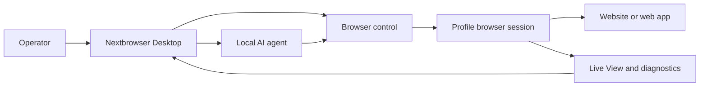

<!-- i18n-source-sha256: af4bcd2f6a6e0d0d097d0d490899d87da19f18d99ab163ce82c094c760efea99 -->

  

<h1 align="center">Nextbrowser</h1>

  <strong>Десктопна консоль на Electron, React і TypeScript для запуску локальних AI-агентів у керованих браузерних сесіях на macOS і Windows.</strong>

  <a href="https://nextbrowser.com/">Сайт</a> ·
  <a href="https://docs.nextbrowser.com/">Документація продукту</a> ·
  <a href="https://nextbrowser.com/use-cases">Сценарії використання</a> ·
  <a href="https://github.com/nextbrowser-oss/nextbrowser-app/releases/latest">Завантажити</a> ·
  <a href="https://github.com/nextbrowser-oss/nextbrowser-app/discussions">Обговорення</a>

  
  
  

  <a href="../../../README.md">English</a> ·
  <a href="../es/README.md">Español</a> ·
  <a href="../pt-BR/README.md">Português (Brasil)</a> ·
  <a href="../zh-CN/README.md">简体中文</a> ·
  <a href="../ja/README.md">日本語</a> ·
  <a href="../ko/README.md">한국어</a> ·
  <a href="../de/README.md">Deutsch</a> ·
  <a href="../fr/README.md">Français</a> ·
  <a href="../ru/README.md">Русский</a> ·
  <strong>Українська</strong> ·
  <a href="../ar/README.md">العربية</a> ·
  <a href="../hi/README.md">हिन्दी</a> ·
  <a href="../tr/README.md">Türkçe</a> ·
  <a href="../id/README.md">Bahasa Indonesia</a> ·
  <a href="../vi/README.md">Tiếng Việt</a> ·
  <a href="../th/README.md">ไทย</a> ·
  <a href="../it/README.md">Italiano</a> ·
  <a href="../pl/README.md">Polski</a> ·
  <a href="../nl/README.md">Nederlands</a> ·
  <a href="../fa/README.md">فارسی</a>

  

## Чому Nextbrowser

Робота AI-агента в браузері — це більше, ніж один запит: оператор має вибрати браузерну ідентичність, керувати сесією, спостерігати за процесом агента та відновлюватися після збою сторінки або запуску. Nextbrowser об’єднує ці елементи керування в одному десктопному інтерфейсі.

- Тримайте профілі, сесії, ротацію proxy/fingerprint і роботу агентів в одному операційному поданні.
- Переглядайте потоковий вивід агента та активність браузера замість того, щоб залишати запуски без спостереження.
- Повторно використовуйте робочі процеси за допомогою skills, власних скриптів, попередніх перевірок і розкладів.
- Діагностуйте стан браузера та викликайте інструменти captcha, коли сторінка показує перевірку; успішне розв’язання ніколи не гарантується.

## Ключові можливості

| Область | Що доступно |
| --- | --- |
| Профілі та сесії | Керування профілями, життєвим циклом сесій і ротацією proxy/fingerprint. |
| Робочий простір агента | Запуск локальних агентів з історією Chat, чергами, засобами зупинки й редагування та відгалуженнями розмов. |
| Повторно використовувані процеси | Застосування skills і власних скриптів із попередньою перевіркою браузерної сесії. |
| Робота за розкладом | Налаштування повторюваних запусків агентів і їх перегляд у десктопній консолі. |
| Спостережуваність | Використовуйте Live View, статус запуску та діагностику для перевірки роботи браузера. |
| Інструменти captcha | Виявляйте перевірки та запускайте підтримувані сценарії обробки без гарантії обходу. |

Концепції, екрани, робочі процеси та рекомендації з експлуатації наведено в [посібнику продукту](../../product-guide.md).

## Швидкий старт

1. Завантажте доступну збірку для macOS або Windows з [останнього релізу Nextbrowser](https://github.com/nextbrowser-oss/nextbrowser-app/releases/latest).
2. Дотримуйтеся [документації продукту](https://docs.nextbrowser.com/), щоб налаштувати браузерне середовище та API key.
3. Відкрийте Nextbrowser, виберіть профіль, запустіть його сесію, виберіть встановленого локального агента та надішліть завдання.
4. Тримайте Chat і Live View відкритими під час виконання завдання; за потреби зупиняйте, редагуйте, ставте роботу в чергу або створюйте відгалуження.

Опис керування браузером і діагностики дивіться у [відповідному довіднику](../../cli-reference.md). Налаштування застосунку та браузера наведено в розділі [конфігурації](../../configuration.md).

## Демонстрації та сценарії використання

Опубліковані сценарії зібрано на [сторінці прикладів використання Nextbrowser](https://nextbrowser.com/use-cases). Попередній перегляд вище показує інтерфейс NextBrowser у роботі.

Поширені робочі процеси:

- запустити сесію профілю, дати локальному агенту завдання у браузері та спостерігати за виконанням;
- застосувати skill або приватний власний скрипт після попередньої перевірки сесії;
- запланувати повторюване завдання, не пов’язуючи робочий процес з обіцянкою дати релізу;
- перевірити стан сесії, вкладки, сторінки та ідентичності після збою запуску;
- виявити captcha та вибрати доступний спосіб обробки із залученням людини, коли це потрібно.

## Як це працює

Nextbrowser — це десктопна поверхня керування. Профілі визначають браузерні ідентичності, сесії надають активний контекст, а робота залишається видимою через Live View і діагностику. Повну модель описано в [посібнику продукту](../../product-guide.md).

## Документація

- [Посібник продукту](../../product-guide.md) — концепції, екрани, робочі процеси та безпека.
- [Довідник із керування браузером](../../cli-reference.md) — основні операції та діагностика Nextbrowser.
- [Конфігурація та розробка](../../../docs/configuration.md) — налаштування застосунку, локальний стан, аналітика та скрипти розробки.
- [Усунення несправностей](../../troubleshooting.md) — діагностика від рівня облікового запису до сторінки та типові способи відновлення.
- [Індекс мов](../README.md) — усі 20 версій README.

## Дорожня карта

Робота над дорожньою картою відстежується через [GitHub Issues](https://github.com/nextbrowser-oss/nextbrowser-app/issues) і дошки проєктів. Issue або картка проєкту є пропозицією, а не зобов’язанням щодо випуску; дати не маються на увазі.

## Участь у розробці

Перед внесенням змін прочитайте [CONTRIBUTING.md](../../../CONTRIBUTING.md). Використовуйте структуровані форми issues для відтворюваних помилок, сфокусованих пропозицій функцій, запитів демонстрацій і виправлень документації. Зміни README мають синхронно оновлювати всі 19 перекладів та i18n manifest.

## Спільнота та підтримка

- Ставте загальні запитання та діліться ідеями в [GitHub Discussions](https://github.com/nextbrowser-oss/nextbrowser-app/discussions).
- Використовуйте [GitHub Issues](https://github.com/nextbrowser-oss/nextbrowser-app/issues) для конкретної роботи з чіткими межами.
- Дотримуйтеся [SECURITY.md](../../../SECURITY.md) для приватного повідомлення про вразливості; не публікуйте відомості про безпеку в issue.
- У разі проблем із runtime і браузерними сесіями почніть із розділу [усунення несправностей](../../troubleshooting.md).

## Ліцензія

Поширюється за ліцензією **MIT**. Повний текст: [opensource.org/licenses/MIT](https://opensource.org/licenses/MIT).
