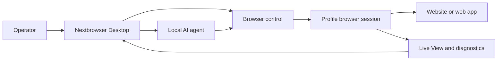

<!-- i18n-source-sha256: af4bcd2f6a6e0d0d097d0d490899d87da19f18d99ab163ce82c094c760efea99 -->

  

<h1 align="center">Nextbrowser</h1>

  <strong>Bảng điều khiển desktop xây dựng bằng Electron, React và TypeScript để chạy AI agent cục bộ trong các phiên trình duyệt được quản lý trên macOS và Windows.</strong>

  <a href="https://nextbrowser.com/">Trang web</a> ·
  <a href="https://docs.nextbrowser.com/">Tài liệu sản phẩm</a> ·
  <a href="https://nextbrowser.com/use-cases">Trường hợp sử dụng</a> ·
  <a href="https://github.com/nextbrowser-oss/nextbrowser-app/releases/latest">Tải xuống</a> ·
  <a href="https://github.com/nextbrowser-oss/nextbrowser-app/discussions">Thảo luận</a>

  
  
  

  <a href="../../../README.md">English</a> ·
  <a href="../es/README.md">Español</a> ·
  <a href="../pt-BR/README.md">Português (Brasil)</a> ·
  <a href="../zh-CN/README.md">简体中文</a> ·
  <a href="../ja/README.md">日本語</a> ·
  <a href="../ko/README.md">한국어</a> ·
  <a href="../de/README.md">Deutsch</a> ·
  <a href="../fr/README.md">Français</a> ·
  <a href="../ru/README.md">Русский</a> ·
  <a href="../uk/README.md">Українська</a> ·
  <a href="../ar/README.md">العربية</a> ·
  <a href="../hi/README.md">हिन्दी</a> ·
  <a href="../tr/README.md">Türkçe</a> ·
  <a href="../id/README.md">Bahasa Indonesia</a> ·
  <strong>Tiếng Việt</strong> ·
  <a href="../th/README.md">ไทย</a> ·
  <a href="../it/README.md">Italiano</a> ·
  <a href="../pl/README.md">Polski</a> ·
  <a href="../nl/README.md">Nederlands</a> ·
  <a href="../fa/README.md">فارسی</a>

  

## Vì sao chọn Nextbrowser

Công việc trình duyệt của AI agent không chỉ là một prompt: người vận hành phải chọn danh tính trình duyệt, điều khiển phiên, quan sát tiến trình của agent và khôi phục khi trang hoặc lượt chạy gặp lỗi. Nextbrowser tập hợp các điều khiển này trong một giao diện desktop.

- Quản lý profile, session, proxy/fingerprint rotation và công việc của agent trong một giao diện vận hành.
- Kiểm tra output dạng stream của agent và hoạt động trình duyệt thay vì coi mỗi lượt chạy là tác vụ chỉ cần khởi động rồi bỏ mặc.
- Tái sử dụng workflow thông qua skill, custom script, preflight check và schedule.
- Chẩn đoán trạng thái trình duyệt và gọi công cụ captcha khi trang đưa ra challenge; không bao giờ có bảo đảm giải thành công.

## Tính năng chính

| Khu vực | Khả năng hiện có |
| --- | --- |
| Profile và session | Quản lý profile, vòng đời session và proxy/fingerprint rotation. |
| Agent workspace | Chạy agent cục bộ với chat history, queue, điều khiển dừng/chỉnh sửa và conversation fork. |
| Workflow tái sử dụng | Áp dụng skill và custom script với bước browser-session preflight. |
| Công việc theo lịch | Cấu hình các lượt chạy agent định kỳ và xem lại từ desktop console. |
| Khả năng quan sát | Dùng Live View, trạng thái lượt chạy và chẩn đoán để kiểm tra công việc trình duyệt. |
| Công cụ captcha | Phát hiện thử thách và gọi luồng xử lý được hỗ trợ mà không đảm bảo vượt qua. |

Xem [hướng dẫn sản phẩm](../../product-guide.md) để tìm hiểu khái niệm, màn hình, workflow và hướng dẫn vận hành.

## Bắt đầu nhanh

1. Tải bản build macOS hoặc Windows hiện có từ [bản phát hành Nextbrowser mới nhất](https://github.com/nextbrowser-oss/nextbrowser-app/releases/latest).
2. Làm theo [tài liệu sản phẩm](https://docs.nextbrowser.com/) để cấu hình môi trường trình duyệt và API key.
3. Mở Nextbrowser, chọn profile, khởi động session của profile đó, chọn agent cục bộ đã cài đặt rồi gửi tác vụ.
4. Giữ Chat và Live View mở khi tác vụ đang chạy; dừng, chỉnh sửa, đưa vào queue hoặc fork công việc khi cần.

Đối với điều khiển trình duyệt và chẩn đoán, hãy xem [tài liệu tham chiếu](../../cli-reference.md). Đối với cấu hình ứng dụng và trình duyệt, hãy xem [cấu hình](../../configuration.md).

## Demo và trường hợp sử dụng

Khám phá các kịch bản đã xuất bản trên [trang trường hợp sử dụng Nextbrowser](https://nextbrowser.com/use-cases). Bản xem trước phía trên cho thấy giao diện NextBrowser đang hoạt động.

Các quy trình phổ biến gồm:

- khởi động profile session, giao tác vụ trình duyệt cho agent cục bộ và theo dõi tiến độ;
- áp dụng skill hoặc custom script riêng tư sau session preflight;
- lên lịch tác vụ định kỳ mà không gắn lời hứa về ngày phát hành cho workflow;
- kiểm tra trạng thái session, tab, page và identity khi một lượt chạy thất bại;
- phát hiện captcha và chọn hướng xử lý hiện có, có sự can thiệp của con người khi cần.

## Cách hoạt động

Nextbrowser là bề mặt điều khiển desktop. Profile xác định danh tính trình duyệt, session cung cấp ngữ cảnh đang hoạt động và hoạt động trình duyệt luôn hiển thị qua Live View cùng chẩn đoán. Đọc [hướng dẫn sản phẩm](../../product-guide.md) để xem mô hình đầy đủ.

## Tài liệu

- [Hướng dẫn sản phẩm](../../product-guide.md) — khái niệm, màn hình, workflow và an toàn.
- [Tham chiếu điều khiển trình duyệt](../../cli-reference.md) — thao tác trình duyệt và chẩn đoán dùng với Nextbrowser.
- [Cấu hình và phát triển](../../../docs/configuration.md) — cài đặt ứng dụng, trạng thái cục bộ, ghi chú phân tích và script phát triển.
- [Khắc phục sự cố](../../troubleshooting.md) — diagnostics từ account đến page và các hướng khôi phục phổ biến.
- [Chỉ mục ngôn ngữ](../README.md) — toàn bộ 20 phiên bản README.

## Lộ trình

Công việc roadmap được theo dõi qua [GitHub Issues](https://github.com/nextbrowser-oss/nextbrowser-app/issues) và bảng dự án. Issue hoặc thẻ dự án là đề xuất, không phải cam kết phát hành; không ngụ ý ngày cụ thể.

## Đóng góp

Đọc [CONTRIBUTING.md](../../../CONTRIBUTING.md) trước khi mở một thay đổi. Hãy dùng issue form có cấu trúc cho bug tái hiện được, feature proposal tập trung, demo request và bản sửa tài liệu. Mọi thay đổi README phải đồng bộ toàn bộ 19 bản dịch và i18n manifest.

## Cộng đồng và hỗ trợ

- Đặt câu hỏi chung và chia sẻ ý tưởng trong [GitHub Discussions](https://github.com/nextbrowser-oss/nextbrowser-app/discussions).
- Dùng [GitHub Issues](https://github.com/nextbrowser-oss/nextbrowser-app/issues) cho công việc có thể thực hiện và có phạm vi rõ ràng.
- Làm theo [SECURITY.md](../../../SECURITY.md) để báo cáo lỗ hổng một cách riêng tư; không đăng chi tiết bảo mật trong issue.
- Bắt đầu với [khắc phục sự cố](../../troubleshooting.md) khi gặp vấn đề về runtime hoặc browser-session.

## Giấy phép

Được phân phối theo giấy phép **MIT**. Toàn văn: [opensource.org/licenses/MIT](https://opensource.org/licenses/MIT).
