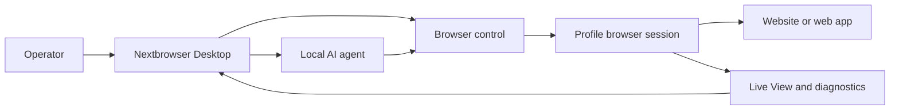

<!-- i18n-source-sha256: 7d99b995b47d93fc8a39fab53df59eab6cc4102b4b900d0d581d9ff8175bb1b5 -->

  

<h1 align="center">Nextbrowser</h1>

  <strong>一款面向 macOS 和 Windows、基于 Electron、React 与 TypeScript 的桌面控制台，用于在受管浏览器会话中运行本地 AI agent。</strong>

  <a href="https://nextbrowser.com/">网站</a> ·
  <a href="https://docs.nextbrowser.com/">产品文档</a> ·
  <a href="https://nextbrowser.com/use-cases">使用场景</a> ·
  <a href="https://github.com/nextbrowser-oss/nextbrowser-app/releases/latest">下载</a> ·
  <a href="https://github.com/nextbrowser-oss/nextbrowser-app/discussions">讨论区</a>

  
  
  

  <a href="../../../README.md">English</a> ·
  <a href="../es/README.md">Español</a> ·
  <a href="../pt-BR/README.md">Português (Brasil)</a> ·
  <strong>简体中文</strong> ·
  <a href="../ja/README.md">日本語</a> ·
  <a href="../ko/README.md">한국어</a> ·
  <a href="../de/README.md">Deutsch</a> ·
  <a href="../fr/README.md">Français</a> ·
  <a href="../ru/README.md">Русский</a> ·
  <a href="../uk/README.md">Українська</a> ·
  <a href="../ar/README.md">العربية</a> ·
  <a href="../hi/README.md">हिन्दी</a> ·
  <a href="../tr/README.md">Türkçe</a> ·
  <a href="../id/README.md">Bahasa Indonesia</a> ·
  <a href="../vi/README.md">Tiếng Việt</a> ·
  <a href="../th/README.md">ไทย</a> ·
  <a href="../it/README.md">Italiano</a> ·
  <a href="../pl/README.md">Polski</a> ·
  <a href="../nl/README.md">Nederlands</a> ·
  <a href="../fa/README.md">فارسی</a>

  

## 为什么选择 Nextbrowser

AI agent 的浏览器工作不只是发送一个 prompt：operator 必须选择浏览器身份、控制 session、保持 agent 进程可观察，并在页面或运行失败时恢复。Nextbrowser 将这些控制能力集中在一个桌面界面中。

- 在一个操作视图中管理 profile、session、proxy/fingerprint rotation 和 agent 工作。
- 检查流式 agent 输出和浏览器活动，而不是把运行当作发出后便无需关注的任务。
- 通过 skill、custom script、preflight check 和 schedule 复用工作流。
- 当页面出现挑战时诊断浏览器状态并调用 captcha 工具；成功解决绝无保证。

## 核心功能

| 领域 | 可用能力 |
| --- | --- |
| Profile 与 session | 管理 profile、session 生命周期以及 proxy/fingerprint rotation。 |
| Agent 工作区 | 运行本地 agent，并使用 chat history、queue、停止/编辑控制和 conversation fork。 |
| 可复用工作流 | 通过 browser-session preflight 应用 skill 和 custom script。 |
| 计划任务 | 配置周期性 agent 运行，并从桌面控制台中查看。 |
| 可见性 | 使用 Live View、运行状态和诊断信息检查浏览器工作。 |
| Captcha 工具 | 检测挑战并调用受支持的处理流程，但不保证绕过。 |

有关概念、界面、工作流和操作指南，请参阅[产品指南](../../product-guide.md)。

## 快速开始

1. 从 [Nextbrowser 最新发行版](https://github.com/nextbrowser-oss/nextbrowser-app/releases/latest)下载可用的 macOS 或 Windows 构建。
2. 按照[产品文档](https://docs.nextbrowser.com/)配置浏览器环境和 API key。
3. 打开 Nextbrowser，选择一个 profile，启动其 session，选择已安装的本地 agent，然后提交任务。
4. 任务运行时保持 Chat 和 Live View 打开；需要时可停止、编辑、排队或 fork 工作。

有关浏览器控制和诊断，请参阅[浏览器控制参考](../../cli-reference.md)；有关应用和浏览器配置，请参阅[配置](../../configuration.md)。

## 演示与使用场景

请在 [Nextbrowser 用例页面](https://nextbrowser.com/use-cases)浏览已发布的场景。上方预览展示了 NextBrowser 界面的实际运行效果。

常见工作流包括：

- 启动 profile session，向本地 agent 分配浏览器任务并观察进度；
- 在 session preflight 后应用 skill 或私有 custom script；
- 安排周期性任务，同时不对该工作流承诺任何发布日期；
- 运行失败时检查 session、tab、page 和 identity 状态；
- 检测 captcha 并选择可用的处理路径，必要时由人工介入。

## 工作原理

Nextbrowser 是桌面控制界面。Profile 定义浏览器身份，session 提供活动浏览器上下文，浏览器活动可通过 Live View 和诊断信息观察。完整模型请参阅[产品指南](../../product-guide.md)。

## 文档

- [产品指南](../../product-guide.md) — 概念、界面、工作流与安全。
- [浏览器控制参考](../../cli-reference.md) — Nextbrowser 使用的浏览器操作和诊断。
- [配置与开发](../../../docs/configuration.md) — 应用设置、本地状态、分析说明和开发脚本。
- [故障排除](../../troubleshooting.md) — 从 account 到 page 的 diagnostics 与常见恢复路径。
- [语言索引](../README.md) — 全部 20 个 README 版本。

## 路线图

路线图工作通过 [GitHub Issues](https://github.com/nextbrowser-oss/nextbrowser-app/issues) 和项目看板跟踪。Issue 或项目卡片仅代表提案，并非发布承诺，也不暗示任何日期。

## 贡献

提交更改前请阅读 [CONTRIBUTING.md](../../../CONTRIBUTING.md)。请使用结构化 issue form 报告可复现的 bug、提出聚焦的 feature proposal、申请 demo 或修正文档。README 更改必须同步维护全部 19 个翻译和 i18n manifest。

## 社区与支持

- 加入 [Nextbrowser Discord](https://discord.gg/jfYjwJQdQ)，参与社区交流、获取配置帮助和产品更新。
- 在 [GitHub Discussions](https://github.com/nextbrowser-oss/nextbrowser-app/discussions) 中提出一般问题并分享想法。
- 使用 [GitHub Issues](https://github.com/nextbrowser-oss/nextbrowser-app/issues) 跟踪可执行且范围明确的工作。
- 按照 [SECURITY.md](../../../SECURITY.md) 私下报告漏洞；不要在 issue 中发布安全细节。
- 如遇 runtime 或 browser-session 问题，请先查看[故障排除](../../troubleshooting.md)。

## 许可证

基于 **MIT** 许可证分发。完整文本：[MIT License](../../../LICENSE)。
